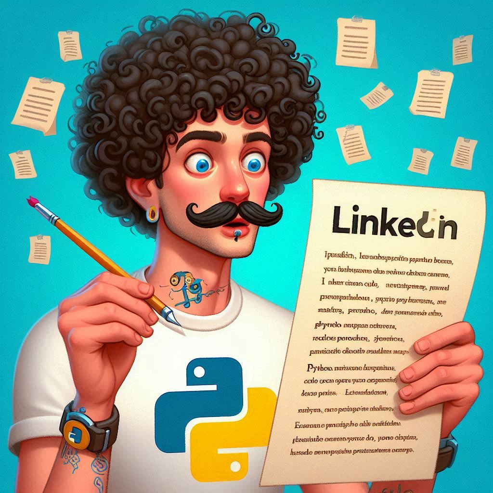

Confession time: I used to dread writing LinkedIn posts. That blinking cursor on an empty screen felt like a personal challenge. So I did what any developer would do - I built an AI sidekick to make the process actually fun. Let me introduce you to my LinkedIn Post Generator!

## Why I Built This Digital Writing Buddy

Like many of you, I knew consistent posting was important but:

- Brainstorming took more energy than actual coding
- My "inspiration moments" always hit at inconvenient times
- Finding visuals felt like a scavenger hunt

The solution? An AI assistant that handles the heavy lifting while keeping **my** voice at the center.

## How It Works - Simple as 1-2-3

### 🎯 1. Plant Your Seed

Just type your core topic - anything from "Python tips" to "career transition stories." This becomes your creative starting point.

### 🎭 2. Find Your Vibe

Choose your personality setting:

- **Witty Wednesday** (for humor)
- **Motivational Monday** (inspiration)
- **Casual Coffee Chat** (authentic thoughts)

### 🎨 3. Visual Polish (Optional)

Tick a box if you want an AI-generated image that understands professional aesthetics - no cringey stock photos!

## Behind the Digital Curtain

The tech stack is like a well-balanced recipe:

- Next.js for the foundation
- OpenAI's GPT as the "idea chef"
- DALL-E as the visual artist
- Lightweight React state management (no heavy libraries!)

## Surprising Lessons Learned

1. **AI is the ultimate improv partner**: It says "yes, and..." to your ideas
2. **Constraints breed creativity**: Limited tone options produce better results
3. **Visuals are secret engagement weapons**: Abstract images outperform literal ones
4. **The magic is in the mix**: AI draft + your personal stories = gold

> "The best part? It saves me 2-3 hours weekly. That's 10% of my work week reclaimed for actual work!"

## Ready to Make Content Creation Fun?

Try the [open-source version yourself](https://github.com/tomdu3/ai-linkedin-post)! Just remember:

- AI writes the first draft
- **You** provide the heart and personality
- Always add personal experiences
- The best posts blend both worlds

Here's to less staring at blank screens and more meaningful connections! ✨

Here's the link to the post I generated on LinkedIn:
[Unleash Your Inner Geek - Top 5 Reasons to Python-ify Your Life! 🐍](https://www.linkedin.com/posts/tomislav-dukez_python-coding-ai-activity-7337419518878638080--grs/)

!