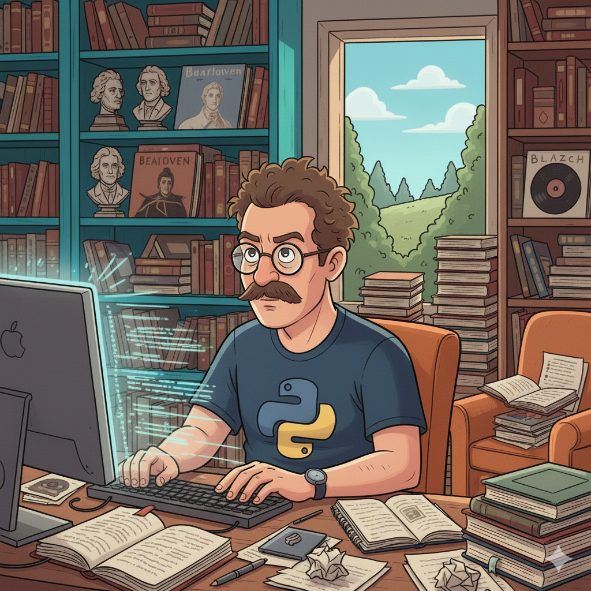
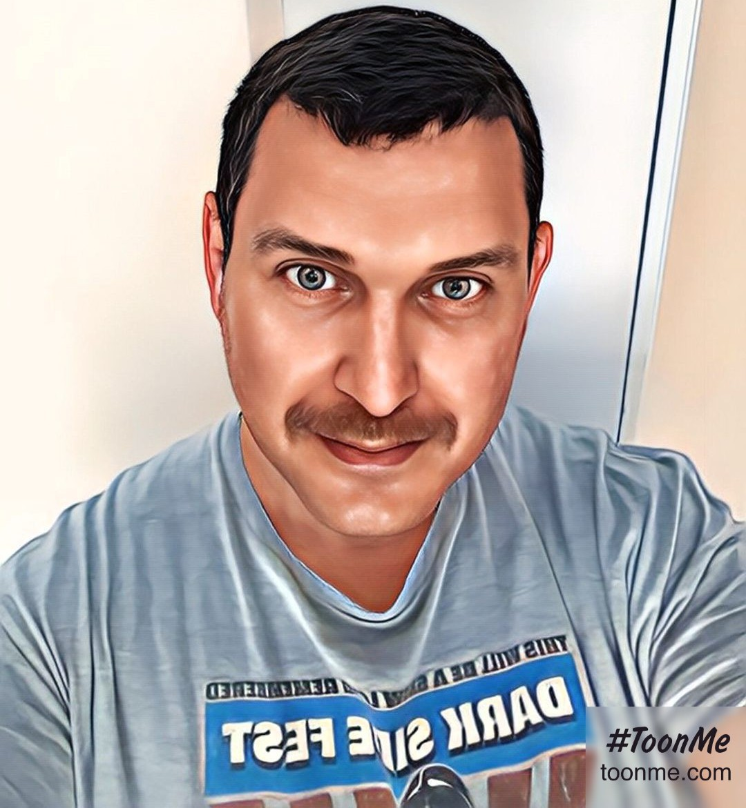

# Beyond 600: 200 Days from Starting This Blog

It's been just over 200 days since I started this blog to document my journey "Beyond 400" consecutive days of coding. The last two months, in particular, have been a whirlwind of learning, building, and (lots of) applying. ⏳ So, what's happened since my last post? Let's dive in. 🤿

## Community & Learning: Finding My Tribe 👨‍💻👩‍💻

I've always believed that coding is better together, and I finally took that to heart by joining **[Codebar](https://codebar.io/)**, a fantastic nonprofit community dedicated to diversifying the tech industry. It's been an incredible experience:

*   **#30DaysofPython:** I participated in their challenge, supported by DataCamp, which was a great way to stay sharp and build consistent habits. 🐍
*   **Leading a Workshop:** I had the opportunity to lead an online workshop on Python fundamentals like scopes, data types, and referencing. Teaching others is one of the best ways to solidify your own understanding. 👨‍🏫
*   **Becoming a Coach:** Inspired by the community (shoutout to Charlene!), I've officially signed up to become a Codebar coach. Giving back feels amazing. ❤️

I also dipped my toes into the **Founders & Coders** ecosystem by participating in a couple of their workshops. While I didn't apply for their full program this time around (more on that below), the experience was invaluable.

## Leveling Up the Tech Stack ⚡

A developer's learning never stops. Here’s what I’ve been grinding on:

*   **Next.js:** I've fully embraced the React framework and have been deeply impressed by its file-based routing, API routes, and seamless React integration. It's become my go-to for full-stack projects. ⚛️
*   **Docker & Coolify:** I went beyond just using Docker and learned **Coolify** for self-hosting. The result? I've successfully deployed all my personal projects to my own **private cloud**, giving me full control over my deployments and a much deeper understanding of DevOps principles. 🐳☁️
*   **Python Certification:** I wrapped up the **Python Associate Track Certification** from DataCamp, formally validating my skills in one of my primary languages. 🏅

## Building & Applying: The Grind and The Glamour 💼

The "what have you built?" and "are you looking for a job?" questions are ever-present. The answer is: a lot, and yes!

*   **Freelance Embedded Project:** I've been working on a deeply interesting freelance project developing an embedded software solution for a custom device. It's been a fantastic challenge that has pushed me into low-level programming and hardware interaction. 🔌
*   **The Job Hunt (`sudo apply --intense`):** I've sent out **200+ applications**. This has led to a handful of promising interview rounds, though nothing has landed just yet. A notable (and frustrating) trend has been the rise of **AI-powered interviews**. I've done about 15 of them so far, and let's just say I prefer human conversation. 🤖❌
*   **Personal Projects:** I'm constantly iterating on my **Notion-based, NextJS/FastAPI blog-project** (you'll see more posts on this soon!). I've also started a new venture: **building a real-time chat application** to get hands-on experience with WebSockets and real-time communication protocols. 💬

## The Verdict: To Infinity and Beyond... 🌌

All in all, I certainly haven't been idle. The path isn't always a straight line—job interviews coincide with courses, freelance projects demand focus, and AI interviews test your patience. But the direction is clear: forward. ↗️

The community is stronger, the skills are sharper, and the projects are more ambitious than ever. Here's to the next 200 days. 🥂

**To infinity and beyond...**