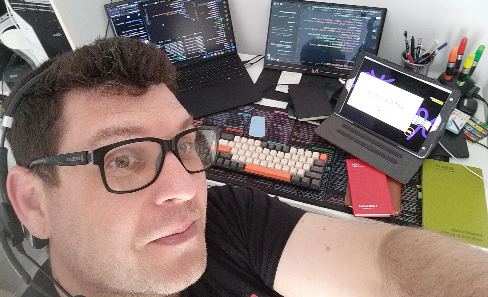

# 🚀 My Coding Journey: From Curious Newbie to Python Pro!

Hey there, fellow tech enthusiasts! 👋

I’m thrilled to share a slice of my life with you all as a software developer and a big-time Python fan. 🐍 My journey into the mystical world of programming has been quite the ride, so grab your favorite drink, sit back, and let’s dive in!

## 💡 A New Chapter Begins

Picture this: I was living a totally different life, feeling like I was stuck in a loop, when BAM! 😳 The Covid pandemic hit, and it hit hard. It was a wake-up call for me. It dawned on me that I wasn’t really vibing with my life choices, and it was high time for some drastic changes. So, I made a bold move and jumped into the software development ocean! 🌊

My first stop? Learning the basics of Python a few years back. I was immediately captivated by what programming could do. It felt like opening a door to a world filled with endless possibilities! 🌈

## 🎓 Bootcamp Adventures


Fast forward a bit, and I found myself signing up for a bootcamp at Code Institute in Dublin (hey, who doesn’t love a good Dublin adventure? ☘️). I dived headfirst into a whirlwind of coding. Git, GitHub, VS Code? Check, check, and check! 

I had a blast exploring HTML, CSS, and JavaScript, whipping up some websites. And of course, my Python skills were getting sharper by the day. I dove into databases like SQL, PostgreSQL, and MySQL, then I discovered Flask and Django – and y’all, I fell hard for web development. I mean, backend development is like the secret sauce 🍔 of websites, am I right?

## 🌟 Exploring New Frontiers 

But wait, there’s more! After my bootcamp, I couldn't stop learning. I took on more training in Data Science and Web Development and got my hands on React, Tailwind CSS, ExpressJS, and MongoDB. Seriously, the more I learned, the more I wanted to know! 📚

Life turned into an exciting game of hopscotch. I quit my job, bounced from the UK to Germany and back again, and found joy in mentoring and tutoring in the Python community. 🥳 Plus, I dipped my toes into open-source projects. Sharing knowledge is the best kind of knowledge!

## 🎉 Reflecting on the Journey



All in all, this journey has unveiled my love for the creative twist of coding, and I’m on a mission to spread that joy. I wholeheartedly believe that coding has the power to transform lives and even change the world. 🌍 Why not inspire others, right?

Last year, I challenged myself to code every single day. No day without a line of code—yep, that’s my mantra! (Or as they say in Latin, **Nulla die sine linea**). I managed to code for 400 days straight! 🎉 And the best part? I’m not stopping anytime soon!

I'm super excited to share here what I'll be working on, and the new things I'll discover. A massive shoutout to [🍥Fuwari](https://github.com/saicaca/fuwari) for inspiring me with the original Astro blog template I’m using here. You rock!       

So, without further ado, let’s code! Here’s a little something to get started. This is my hello world post, and it is so appropriate to post my first code snippet here. 😄 In a language that I am learning at the moment: [`R`](https://www.r-project.org/). 📦

```r
print("Hello World!", quote = TRUE)
```

```plaintext
[1] "Hello World!"
```

Alright, let's embark on this coding adventure together. Who's ready? 🙌💻