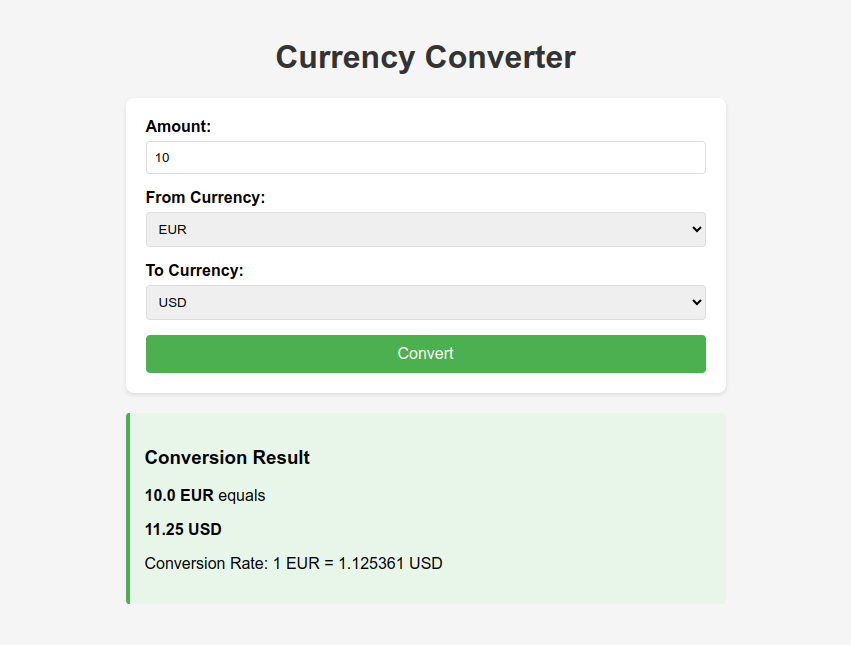

## Show Me the Money: Introduction
Ever wondered how to keep track of your money across different currencies? I've created a sleek Django application that does just that! Using the ExchangeRates API, this converter brings you real-time currency conversion capabilities with just a few lines of code.

## Change for the Better: Technical Overview
The application consists of three main components:

### 1. The Money Pit: Backend Structure
```python
# views.py highlights
def currency_convert(request):
    form = CurrencyConversionForm(request.POST or None)
    if form.is_valid():
        # Fetch real-time rates from ExchangeRates API
        endpoint = f'https://api.exchangeratesapi.io/v1/latest?access_key={API_KEY}&symbols={from_currency},{to_currency}'
```

The view handles API communication and calculations, using environment variables for secure API key storage.


### 2. Cash Flow: Form Management
```python
# forms.py highlights
CURRENCY_CHOICES = [
    ('USD', 'USD'),
    ('EUR', 'EUR'),
    ('GBP', 'GBP')
]
```
A clean form implementation supporting major currencies with built-in validation.

### 3. Rich Design: Frontend Styling
The UI features a modern, responsive design with:
- Clean card-based layout
- Intuitive input fields
- Error handling with visual feedback
- Smooth conversion display


## Cents and Sensibility: Key Features
- **Real-time Exchange Rates**: Direct integration with ExchangeRates API
- **Error Handling**: Robust error management for API failures
- **Input Validation**: Minimum value checks and decimal support
- **Responsive Design**: Mobile-friendly interface
- **Easy Integration**: Modular design for larger projects

## Penny for Your Thoughts: Implementation Details
The converter uses EUR as a base currency for calculations, performing two-step conversions when needed. The stylish CSS ensures a professional look while maintaining functionality.

## Banking on Success: Future Improvements
- Add more currency options
- Implement historical rate tracking
- Create API endpoint for external use
- Add rate alerts functionality



## Show Me the Money: Conclusion
I hope this application inspires you to keep track of your money and make conversions with ease.

Github repo: https://github.com/tomdu3/django-test
- [Currency Converter App](https://github.com/tomdu3/django-test/tree/main/currency_convert)


