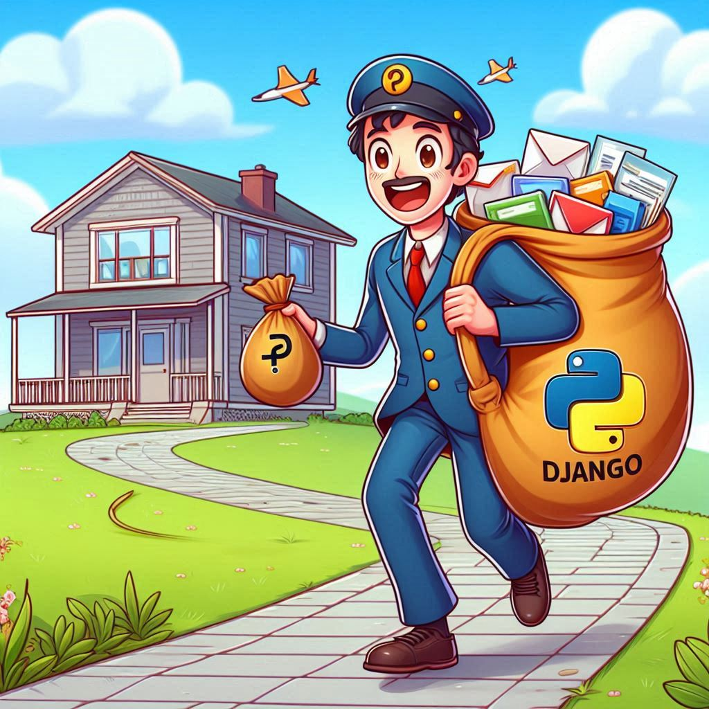

The other day, I was working on a Django project that needed **personalized email functionality**. After consulting Django’s excellent documentation, some StackOverflow wisdom, and a few helpful blogs (shoutout to all the devs who share their knowledge! 🙌), I built a **robust email-sending solution**.  

Let me walk you through it—**with extra puns because why not?** 😏  

---  

## **⚙️ The Email Backend Setup (settings.py) – Where the Magic Begins**  

First, the **configuration magic** happens in `settings.py`. Here’s the key email setup:  

```python
# Email Configuration - The SMTP Orchestra Conductor 🎻  
EMAIL_BACKEND = "django.core.mail.backends.smtp.EmailBackend"  # SMTP FTW!  
EMAIL_HOST = "smtp.gmail.com"  # Google's SMTP server (because we trust them with our emails... mostly)  
EMAIL_PORT = 587  # TLS lives here (the secure bouncer at the club 🕶️)  
EMAIL_USE_TLS = True  # Encryption is cool 😎  
EMAIL_USE_SSL = False  # Not today, Satan!  
EMAIL_HOST_USER = os.getenv("EMAIL_HOST_USER")  # Your email (env vars keep it secret!)  
EMAIL_HOST_PASSWORD = os.getenv("EMAIL_HOST_PASSWORD")  # App password (not your real one—don’t be reckless!)  
DEFAULT_FROM_EMAIL = os.getenv("DEFAULT_FROM_EMAIL")  # "From" address (because anonymity is overrated)  
```  

### **🔑 Key Takeaways & Puns:**  
- **Environment variables** are your **best friends**—never hardcode credentials unless you *want* to get hacked. 🔐  
- **TLS (port 587)** is like the **bouncer** at a VIP club—it keeps your emails safe from eavesdroppers. 🚪  
- **Gmail’s SMTP** is reliable, but if you’re sending **tons of emails**, consider **SendGrid** or **Mailgun**—they won’t ghost you. 👻  

---  

## **🧩 The Send Email App Breakdown – Because Modularity Rocks**  

### **1️⃣ apps.py – The Humble Hero (That Does Almost Nothing)**  

```python
from django.apps import AppConfig  

class SendEmailConfig(AppConfig):  
    default_auto_field = "django.db.models.BigAutoField"  # BigInt for IDs (future-proofing!)  
    name = "send_email"  # Our app’s identity 🆔  
```  

**Why this matters:**  
- This is Django’s way of saying, *"Hey, I see you made an app. Cool. Here’s a name tag."* 🏷️  
- The `default_auto_field` ensures we don’t run out of IDs (because nobody likes an **integer overflow crisis**).  

---  

### **2️⃣ forms.py – The Gatekeeper (AKA The Bouncer of Data)**  

```python
from django import forms  

class EmailForm(forms.Form):  
    # Form fields with Bootstrap classes because we're fancy 💅  
    subject = forms.CharField(  
        max_length=100,  
        widget=forms.TextInput(attrs={'class': 'form-control'})  
    )  
    message = forms.CharField(  
        widget=forms.Textarea(attrs={'class': 'form-control', 'rows': 5})  
    )  
    recipient = forms.EmailField(  
        widget=forms.EmailInput(attrs={'class': 'form-control'})  
    )  
```  

**Why this matters:**  
- **Django forms** handle **validation** so you don’t have to—because manually checking emails is *so* 1999. 📧  
- The `widget` attributes add **Bootstrap styling**—because ugly forms are a crime against UX. 🚨  
- **Max length on subject?** Yes, because nobody needs a **novel** in their email subject line. 📚  

---  

### **3️⃣ urls.py – The Traffic Director (AKA The GPS of Your App)**  

```python
from django.urls import path  
from . import views  

urlpatterns = [  
    path('', views.send_email, name='send_email'),  # Main email form (the star of the show 🌟)  
    path('sent/', views.email_sent, name='email_sent'),  # Success page (confetti moment 🎉)  
]  
```  

**Why this matters:**  
- This is where Django **routes requests**—think of it as a **mailroom worker** directing packages. 📦  
- The `name` parameter lets you **reverse URLs** (so you don’t hardcode paths—because we’re not cavemen).  

 
---  

### **4️⃣ views.py – Where the Real Magic Happens (Abracadabra! ✨)**  

```python
def send_email(request):  
    if request.method == 'POST':  
        form = EmailForm(request.POST)  
        if form.is_valid():  
            try:  
                # Extract clean data from our trustworthy form  
                subject = form.cleaned_data['subject']  
                message = form.cleaned_data['message']  
                recipient = form.cleaned_data['recipient']  
                
                # Render HTML email template (because plain text is so 1995)  
                html_message = render_to_string('send_email/email_template.html', {  
                    'subject': subject,  
                    'message': message,  
                })  
                
                # Create the email package 📦  
                email = EmailMessage(  
                    subject,  
                    html_message,  
                    settings.DEFAULT_FROM_EMAIL,  # From our settings!  
                    [recipient],  # To our lucky recipient  
                )  
                email.content_subtype = "html"  # HTML emails for the win!  
                email.send()  # And... liftoff! 🚀  
                
                return redirect('email_sent')  # Success! 🎉  
                
            except smtplib.SMTPSenderRefused as e:  
                # Handle email sending errors gracefully  
                form.add_error(None, f"Sender refused: {e}")  
            except smtplib.SMTPAuthenticationError as e:  
                form.add_error(None, "Authentication failed. Check your email settings.")  
            except Exception as e:  
                form.add_error(None, f"Error sending email: {e}")  
    else:  
        form = EmailForm()  # Fresh form for GET requests  
    
    return render(request, 'send_email/send_email.html', {'form': form})  
```  

**Why this matters:**  
- **`form.is_valid()`** ensures we only send **clean data**—no spammy nonsense here. 🚫  
- **`render_to_string`** lets us send **fancy HTML emails**—because plain text is boring. 🎨  
- **Error handling** is crucial—because SMTP servers can be **moody divas**. 🎭  

---  


## **🎬 Final Thoughts & Pro Tips**  
✅ **Always use environment variables**—hardcoding credentials is like leaving your house keys in the door. 🔑  
✅ **Test with `EMAIL_BACKEND = 'console'` in development**—no accidental emails to your boss! 😅  
✅ **Consider async tasks (Celery)** if sending **many emails**—nobody likes a frozen UI. ❄️  

And there you have it! A **fully functional Django email sender**—now go forth and **automate those emails** like a pro! 🚀  

Github repo: https://github.com/tomdu3/django-test

