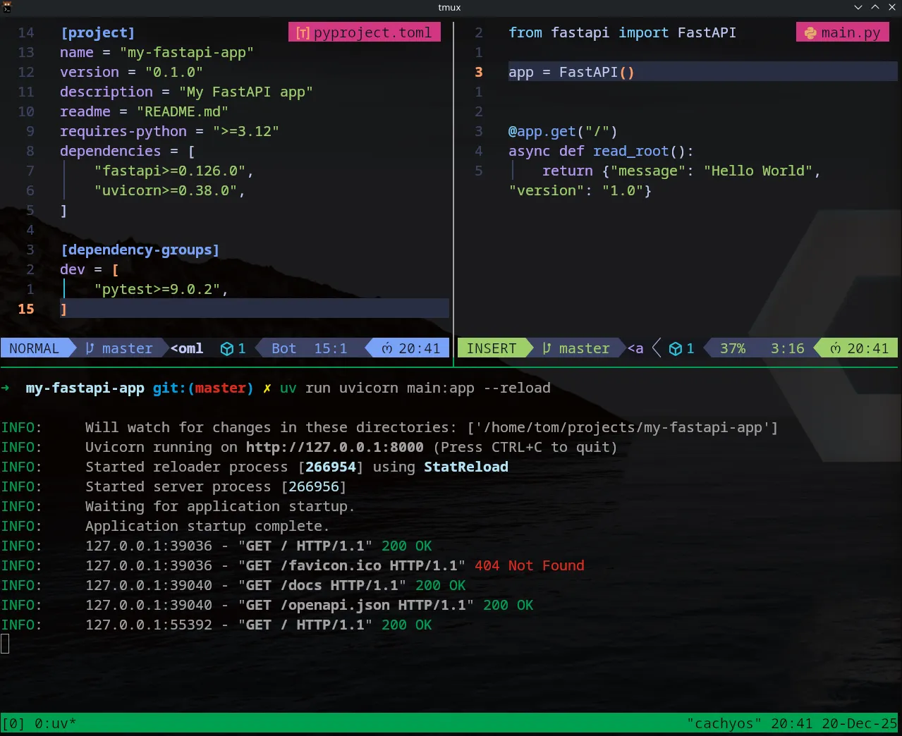
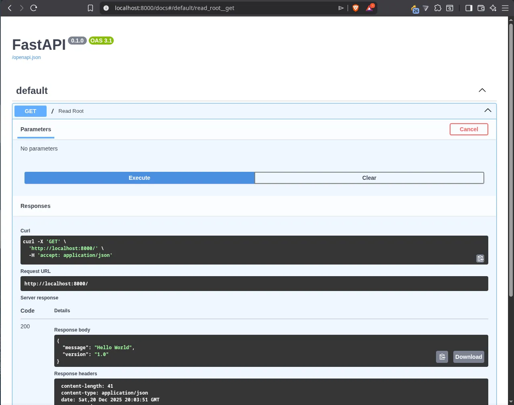

Welcome to Day 1 of my **30 Days of FastAPI** journey! Today is all about laying the groundwork. I’m moving away from the "old way" of managing Python environments and embracing **uv**, the lightning-fast package manager written in Rust.

## 🛠️ The Setup: Faster than a Coffee Break

Instead of the usual `venv` and `pip` dance, I used `uv` to get everything running in seconds. Here is the step-by-step:

### 1. Initialize the Project

First, I created the project structure. `uv` handles the creation of the `pyproject.toml`. Then I created the virtual environment with `uv venv`.

```bash
uv init my-fastapi-app
cd my-fastapi-app
uv venv
```

### 2. Add Dependencies

Next, I added FastAPI and Uvicorn (the ASGI server).

```bash
uv add fastapi uvicorn
```

*Observation: The installation was nearly instantaneous. `uv` caches aggressively, making this step much smoother than standard pip.*

### 3. The "Hello World" Code

I created a simple `main.py` file to verify the installation:

```python
from fastapi import FastAPI

app = FastAPI()

@app.get("/")
def read_root():
    return {"message": "Hello World"}

```

### 4. Running the API

To start the development server with "hot reload" (so it updates whenever I save the file), I ran:

```bash
uv run uvicorn main:app --reload

```

---

## 🔍 Exploring the Interactive Docs (Swagger UI)

One of FastAPI's "killer features" is that it documents itself. Once the server was running, I navigated to:
👉 `http://127.0.0.1:8000/docs`

FastAPI automatically generated a **Swagger UI** page where I could test my endpoint directly from the browser. No Postman required for Day 1!


---

## 📚 My Learning Resources

I’ll be sticking to these high-quality resources to guide my 30-day sprint:

* **Course:** [FastAPI – Help You Develop APIs Quickly](https://www.freecodecamp.org/news/fastapi-helps-you-develop-apis-quickly/) by Beau Carnes (FreeCodeCamp).
* **Book:** *FastAPI: Modern Python Web Development* by Bill Lubanovic (O’Reilly).

---

## 🛠️ uv Cheat Sheet for FastAPI Development

I'll be keeping this handy throughout the month. If you are starting out, save this!

| Action | Command |
| --- | --- |
| **New Project** | `uv init <name>` |
| **Add Library** | `uv add <package-name>` |
| **Remove Library** | `uv remove <package-name>` |
| **Run App** | `uv run uvicorn main:app --reload` |
| **Sync Env** | `uv sync` |
| **Check Tree** | `uv tree` |

---

## 🏁 Reflection

Day 1 was a success. The combination of **FastAPI** and **uv** feels incredibly modern and friction-less. Tomorrow, I'm diving into **Path Parameters** to see how FastAPI handles dynamic data in URLs.

See you on Day 2!

---
Here is a concise **uv Cheat Sheet** tailored for your FastAPI workflow over the next 30 days.

---

## 🛠️ uv Cheat Sheet for FastAPI Development

### 1. Project Initialization

Starting a new project from scratch.

* **`uv init`**: Initializes a new project with a `pyproject.toml`.
* **`uv venv`**: (Optional) Manually create a virtual environment, though `uv run` handles this automatically.

### 2. Managing Dependencies

This is what you will use most often as you add libraries like Pydantic, SQLAlchemy, or Jose (for JWT).

* **`uv add fastapi uvicorn`**: Adds dependencies to your project and installs them.
* **`uv add --dev pytest`**: Adds a package only for development/testing.
* **`uv remove <package>`**: Removes a dependency.
* **`uv tree`**: Visualizes your dependency graph (great for seeing what FastAPI relies on).

### 3. Running Your Application

You don't need to "activate" environments manually if you use `uv run`.

* **`uv run uvicorn main:app --reload`**: Runs your FastAPI app in the managed environment.
* **`uv run python script.py`**: Runs a specific Python script using project dependencies.

### 4. Environment & Python Versions

* **`uv python install 3.12`**: Installs a specific Python version if you don't have it.
* **`uv sync`**: Ensures your lockfile and environment are perfectly aligned.

---

## 💡 How `uv` fits into the FastAPI Lifecycle

| Task | Traditional Way | The **uv** Way |
| --- | --- | --- |
| **Install Packages** | `pip install fastapi` | `uv add fastapi` |
| **Create Env** | `python -m venv .venv` | Automatic (or `uv venv`) |
| **Run App** | `source .venv/bin/activate && uvicorn...` | `uv run uvicorn...` |
| **Update Lockfile** | `pip freeze > requirements.txt` | Automatic (`uv.lock`) |
