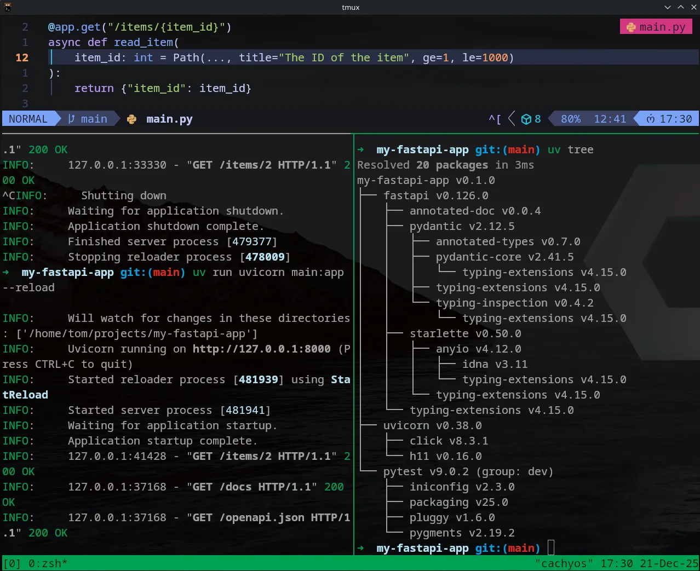
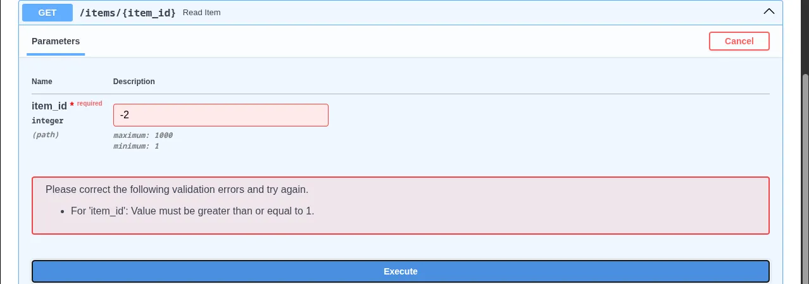

In a REST API, resources are usually identified by their location in the URL path. Today, I explored how FastAPI handles these **Path Parameters** and how it uses Python type hints to perform "magic" under the hood.

### 1. The Basic Dynamic Route

To capture a value from the URL, we use curly braces `{}` in the decorator and pass the same name as an argument to our function.

```python
from fastapi import FastAPI

app = FastAPI()

@app.get("/items/{item_id}")
async def read_item(item_id: int):
    return {"item_id": item_id, "message": f"Fetching item {item_id}"}

```

### 2. Automatic Data Conversion

This is one of my favorite features so far. Even though URLs are strings, FastAPI looks at my type hint (`item_id: int`) and:

1. **Parses** the string "5" into the Python integer `5`.
2. **Validates** the data. If I visit `/items/foo`, FastAPI catches the error before the function even runs.

### 3. Advanced Validation with the `Path` Class

Sometimes, a type hint isn't enough. What if an ID cannot be negative? I learned to use the `Path` class from `fastapi` to add metadata and numeric constraints.

```python
from fastapi import FastAPI, Path

app = FastAPI()

@app.get("/items/{item_id}")
async def read_item(
    item_id: int = Path(..., title="The ID of the item", ge=1, le=1000)
):
    return {"item_id": item_id}

```

* `ge=1`: Greater than or equal to 1.
* `le=1000`: Less than or equal to 1000.



### 🛠️ Working with `uv`

To keep my environment clean, I didn't need to install anything new today, but I used `uv tree` to inspect how Pydantic (the validation engine) is integrated into FastAPI.

### 🔍 Swagger UI Check

Visiting `http://127.0.0.1:8000/docs` now shows a "Required" field for `item_id`. It even lists the "Minimum 1" constraint I added!


---

## 📚 Resources

* **Course:** [FastAPI helps you develop APIs quickly](https://www.freecodecamp.org/news/fastapi-helps-you-develop-apis-quickly/)
* **Book:** *FastAPI: Modern Python Web Development* by Bill Lubanovic (O’Reilly).

---

[FastAPI Path Parameters & Numeric Validation](https://www.youtube.com/watch?v=1L5Khpz8u6w)

This video walks through exactly what you've learned today, showing the real-time feedback you get in the terminal and Swagger UI when path constraints are met or failed.