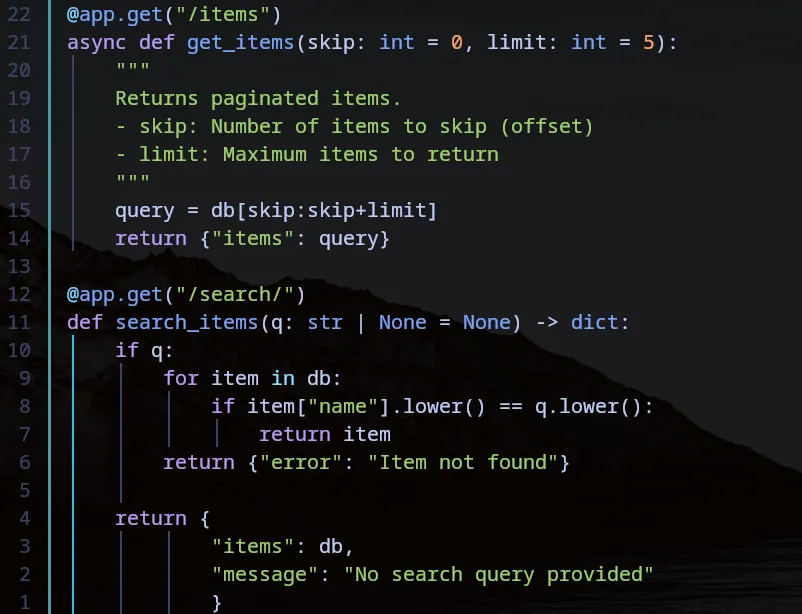
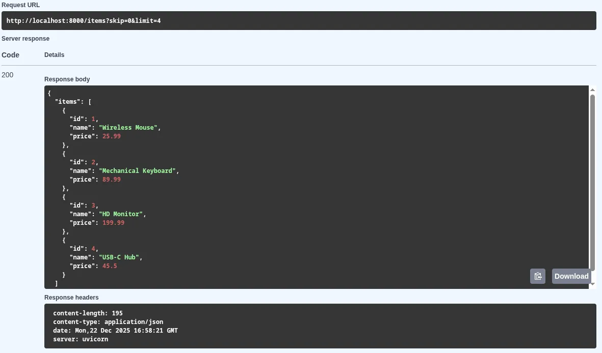
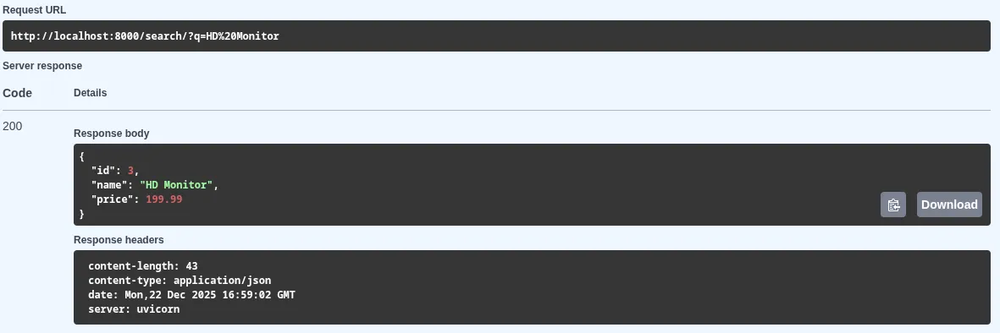

Yesterday, we learned how to get a specific item using `/items/{item_id}`. But what if we want to see a list of items and filter them? That’s where **Query Parameters** shine.

### 1. What are Query Parameters?

Query parameters are key-value pairs that appear after the `?` in a URL. In FastAPI, any function argument that is **not** part of the path is automatically interpreted as a query parameter.

```python
from fastapi import FastAPI

app = FastAPI()

# 'skip' and 'limit' are query parameters
@app.get("/items/")
async def read_items(skip: int = 0, limit: int = 10):
    return {"skip": skip, "limit": limit}

```

### 2. Making Parameters Optional

FastAPI uses Python type hints to decide if a parameter is required. By providing a default value (like `None`), the parameter becomes optional.

```python
@app.get("/search/")
async def search_items(q: str | None = None):
    return {"query": q} if q else {"query": "No search provided"}

```



### 🛠️ Implementation

Today I updated my project to handle basic pagination. By using `uv run`, I kept my environment isolated and my `uv.lock` file updated as I experimented with different logic.

**Checklist:**

* [x] Created an endpoint with multiple query parameters.
* [x] Verified that Swagger UI (`/docs`) handles boolean toggles correctly.
* [x] Confirmed type validation is working for numeric queries.





In FastAPI, **path and query parameters** serve distinct roles in defining how data is captured from a URL and processed by the application. While path parameters are typically used to identify a specific resource, query parameters are generally used for filtering, sorting, or pagination.

### **Path Parameters**
*   **Definition and Syntax:** Path parameters are dynamic parts of a URL path, defined in the path operation decorator using **curly brackets** (e.g., `@app.get("/items/{item_id}")`). 
*   **Requirement:** These parameters are **mandatory**; if the client does not provide a value at the specified position in the URL, the route will not match, often resulting in a "404 Not Found" error.
*   **Use Case:** They are primarily utilized to locate or **retrieve a specific resource** within a collection, such as a user by their ID or a book by its title.
*   **Validation:** FastAPI provides a `Path()` class to declare metadata and add **numeric or string validations** (such as `min_length` or `ge` for "greater than or equal to") specifically for these parameters.

### **Query Parameters**
*   **Definition and Syntax:** Query parameters are **key-value pairs** appended to the end of a URL after a **question mark** (`?`) and separated by ampersands (`&`). They are not declared in the path decorator but are included as arguments in the path operation function.
*   **Optionality and Defaults:** Unlike path parameters, query parameters can be **optional**. You can define **default values** for them in the function signature; if the client omits them from the URL, FastAPI will automatically use the specified default.
*   **Use Case:** They are ideal for **refining or customizing** a response, such as providing optional filters, searching by keyword, or managing **pagination** (e.g., `?skip=0&limit=10`).
*   **Validation:** The `Query()` class is used to apply advanced constraints, such as **Regular Expressions (RegEx)** or range limits, while also allowing developers to add metadata like titles and descriptions for automated documentation.

### **Key Comparisons**

| Feature | Path Parameters | Query Parameters |
| :--- | :--- | :--- |
| **Location** | Part of the URL path itself. | Appended after the `?` in the URL. |
| **Requirement** | Always **mandatory**. | Can be **optional** with default values. |
| **Primary Purpose** | **Resource identification**. | **Filtering, sorting, and pagination**. |
| **FastAPI Tool** | The `Path()` class. | The `Query()` class. |

**Analogy:** Imagine a large **library**. A **path parameter** is like the **unique call number** on the spine of a specific book; you need it to point exactly to that one item on the shelf. A **query parameter** is like asking the librarian for "all history books" or "only books published after 2010"; it doesn't change which library you are in, but it **filters the results** you see.

---

## 📚 Resources

1. **Documentation:** [FastAPI Query Parameters Tutorial](https://fastapi.tiangolo.com/tutorial/query-params/)
2. **Course:** [FastAPI – FreeCodeCamp](https://www.freecodecamp.org/news/fastapi-helps-you-develop-apis-quickly/)
3. **Book:** *FastAPI: Modern Python Web Development* (Bill Lubanovic).
