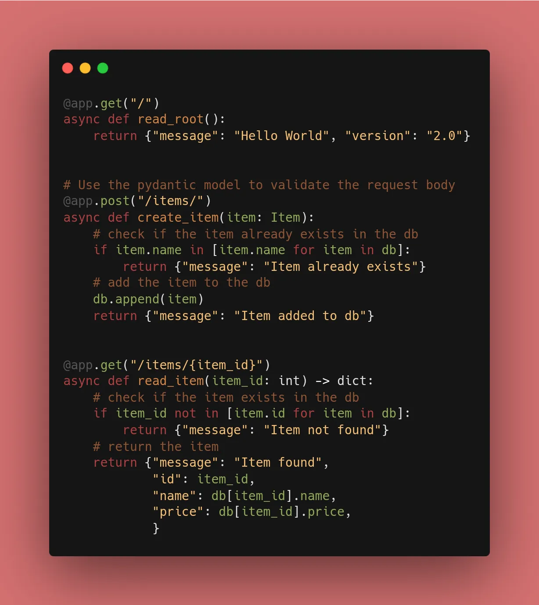
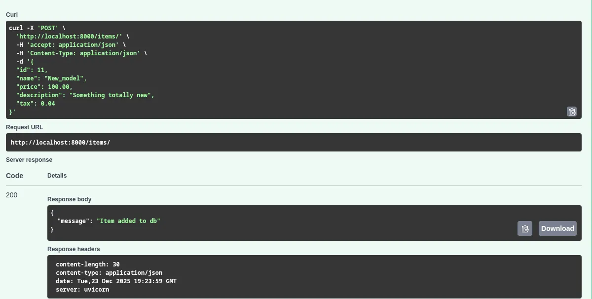
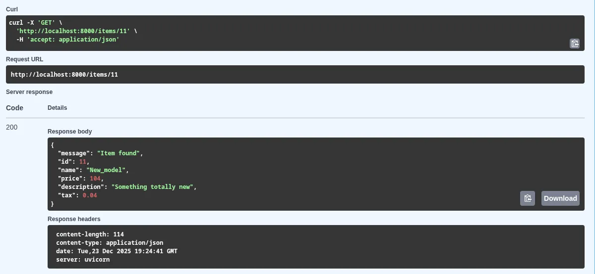

Today was about making the API functional. Instead of just echoing back what the user sends, I implemented a system to **store**, **validate**, and **process** data using Pydantic and a local JSON file.

### 1. The Pydantic Schema

I defined a schema that mirrors a real database record. By allowing `id` to be `None`, I can receive an item from a user (who won't know the ID yet) and assign it one later in the code.

```python
class Item(BaseModel):
    id: int | None = None
    name: str
    price: float
    description: str | None = None
    tax: float | None = None

```
### 2. Mocking the Database

I used a `db.json` file to store my data. To make it work seamlessly with FastAPI, I converted the raw JSON into a list of Pydantic models upon startup:

```python
with open("db.json") as f:
    db = json.load(f)
db = [Item(**item) for item in db]

```


### 3. Adding Logic to POST & GET

I didn't just create endpoints; I added **Business Logic**:

* **Validation:** In `@app.post`, I check the "database" list to see if the item name already exists to prevent duplicates.
* **Calculation:** In `@app.get`, I dynamically calculate the price inclusive of tax based on the stored tax rate.

### 🛠️ Implementation & Testing

I used the Swagger UI (`/docs`) to test the following:

* [x] Sending a `POST` request to add a new item.
* [x] Trying to `POST` the same item again (checking for the "Item already exists" message).
* [x] Performing a `GET` on a specific ID to see the tax calculation in action.



---

## 📚 Resources

1. **Documentation:** [FastAPI Request Body Tutorial](https://fastapi.tiangolo.com/tutorial/body/)
2. **Course:** [FastAPI – FreeCodeCamp](https://www.freecodecamp.org/news/fastapi-helps-you-develop-apis-quickly/)
3. **Book:** *FastAPI: Modern Python Web Development* (Chapter 4).

---

## A bit more about Request Bodies — Data Validation with Pydantic

**HTTP Request Body** is used when we need to send data that is too complex for a URL, typically during `POST`, `PUT`, or `PATCH` operations.

### 1. Defining the Schema with Pydantic

FastAPI uses **Pydantic** for data validation. We define what our data "should" look like by creating a class that inherits from `BaseModel`.

```python
from fastapi import FastAPI
from pydantic import BaseModel

class Item(BaseModel):
    name: str
    description: str | None = None
    price: float
    tax: float | None = None

app = FastAPI()

@app.post("/items/")
async def create_item(item: Item):
    return item

```

### 2. What happens under the hood?

When a request hits this endpoint:

1. **Read:** FastAPI reads the body as JSON.
2. **Convert:** It converts JSON types to Python types (e.g., `float`, `int`, `str`).
3. **Validate:** It checks if all required fields are present and correctly typed.
4. **Objectify:** It gives you a Python object (`item`) that you can use with dot notation (like `item.price`).

### 3. Testing with Swagger UI

This is where the `/docs` page really shines. FastAPI automatically generates a **JSON Schema** for your model. In the Swagger UI, you can click "Try it out," and it provides a pre-filled JSON template for you to edit and send.

### 🛠️ Implementation Checklist

* [x] Defined a `BaseModel` for a resource.
* [x] Created a `@app.post` endpoint.
* [x] Triggered a validation error (422) by sending bad data on purpose.
* [x] Confirmed that optional fields (with `= None`) work correctly.