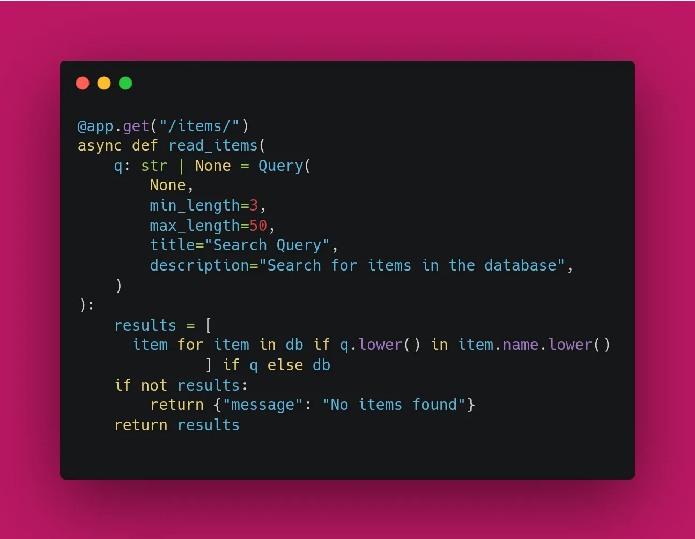
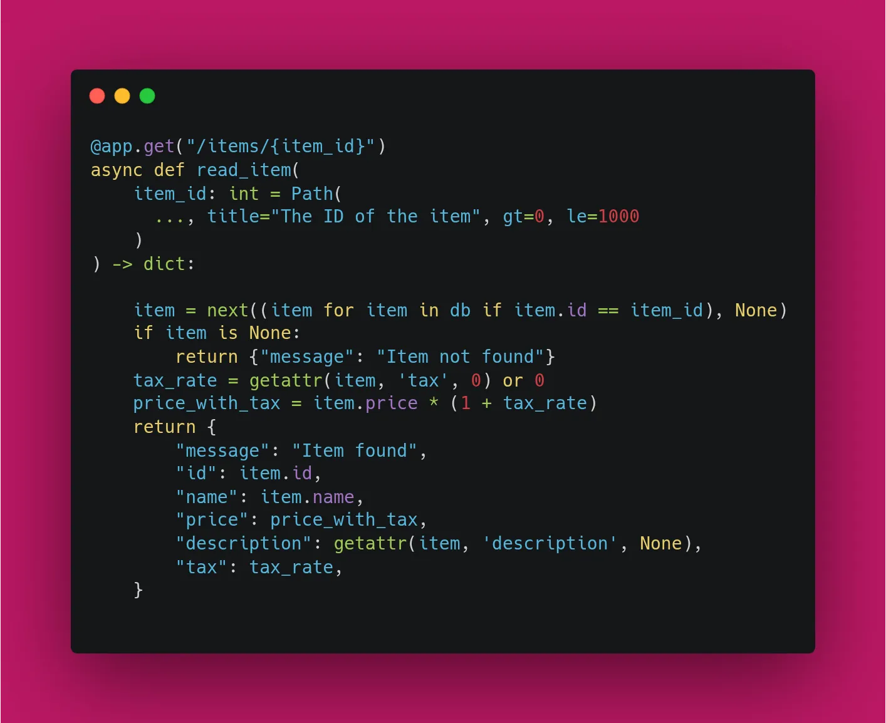

On Day 4, we saw how Pydantic ensures we get a `str` or an `int`. Today, we explore how to add **Constraints**. FastAPI provides the `Query`, `Path`, and `Body` classes to add validation and metadata to your parameters.

### 1. Validating Query Parameters

Suppose you have a search endpoint. You want to make sure the search term `q` is at least 3 characters but no more than 50.

```python
from fastapi import FastAPI, Query

app = FastAPI()

@app.get("/items/")
async def read_items(
    q: str | None = Query(
        None, 
        min_length=3, 
        max_length=50, 
        pattern="^fixedquery$",  # regex pattern to match
        title="Search Query",
        description="Search for items in the database"
    )
):
    return {"q": q}

```



### 2. Validating Path Parameters

The `Path` class works similarly but for the variables inside your URL. You can enforce numeric constraints like `gt` (greater than) or `le` (less than or equal to).

```python
from fastapi import FastAPI, Path

@app.get("/items/{item_id}")
async def read_item(
    item_id: int = Path(..., title="The ID of the item", gt=0, le=1000)
):
    return {"item_id": item_id}

```


### 3. Why Metadata Matters

By adding `title` and `description`, your **Swagger UI** (`/docs`) becomes a complete manual. Any developer using your API will see the exact constraints (e.g., "Minimum length: 3") without you writing a single word of external documentation.

### 🛠️ Implementation Checklist

* [x] Added `min_length` validation to a string query.
* [x] Added `gt` (greater than) validation to a numeric path parameter.
* [x] Added a custom `description` to an endpoint parameter.
* [x] Verified that a `422 Unprocessable Entity` error is returned when rules are broken.

---

## 📚 Resources

1. **Documentation:** [FastAPI Path Parameters and Numeric Validation](https://fastapi.tiangolo.com/tutorial/path-params-numeric-validations/)
2. **Documentation:** [FastAPI Query Parameters and String Validation](https://fastapi.tiangolo.com/tutorial/query-params-str-validations/)
3. **Course:** [FastAPI – FreeCodeCamp](https://www.freecodecamp.org/news/fastapi-helps-you-develop-apis-quickly/)
