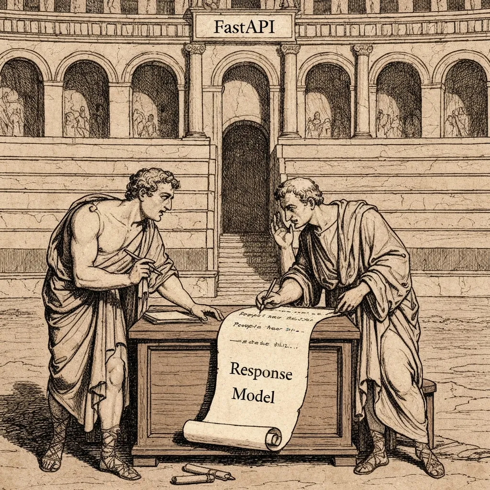
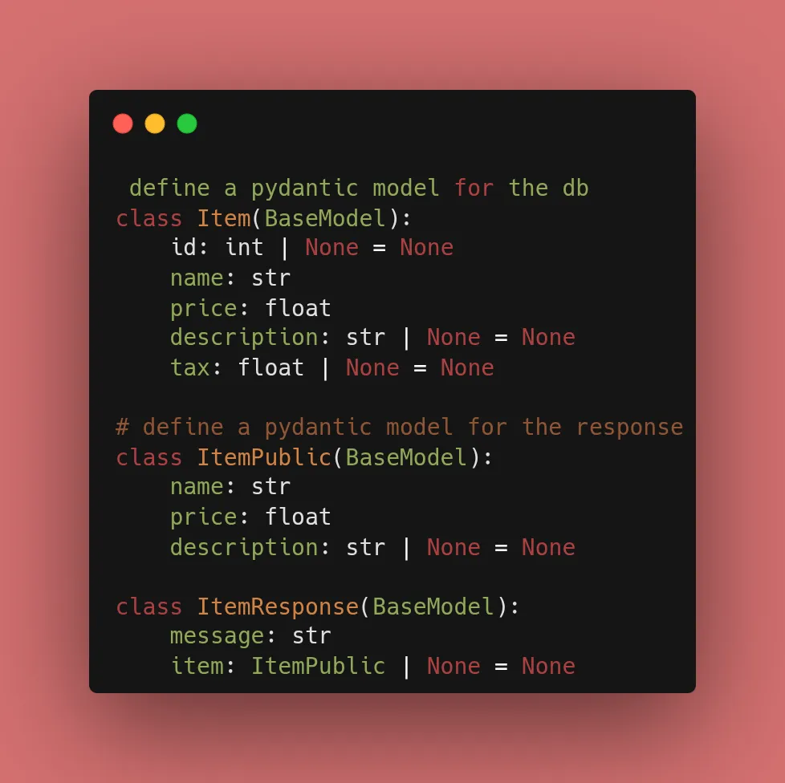

After 2 days of Christmas holidays, we are back to our 30 Days of FastAPI series. Today’s focus was on **Data Transformation**. In professional APIs, we use "Schemas" or "Data Transfer Objects" (DTOs) to control exactly what data leaves our server.

### 🏗️ The Core Idea: Three Models

The heart of today’s work was defining three distinct Pydantic models to handle different stages of the data lifecycle.



#### 1. The Database Model (Internal)

This is what we store. It includes the `tax` field, which we use for internal calculations but don't want to expose directly.

```python
class Item(BaseModel):
    id: int | None = None
    name: str
    price: float
    description: str | None = None
    tax: float | None = None

```

#### 2. The Public Data Model (Filtered)

This is the "shape" of the item the user sees. Notice the `tax` field is gone.

```python
class ItemPublic(BaseModel):
    name: str
    price: float  # We will put the tax-inclusive price here
    description: str | None = None

```

#### 3. The Response Envelope (Standardized)

This ensures every successful or failed request returns a predictable JSON structure.

```python
class ItemResponse(BaseModel):
    message: str
    item: ItemPublic | None = None

```



### 🛠️ Implementation: The Transformation Logic

When we fetch an item, we manually map the data from our internal `Item` to our `ItemPublic` model. FastAPI then wraps it in the `ItemResponse`.

```python
@app.get("/items/{item_id}", response_model=ItemResponse)
async def read_item(item_id: int = Path(..., gt=0)):
    # 1. Fetch from 'db' (Internal Item model)
    item = next((item for item in db if item.id == item_id), None)
    
    if item is None:
        return ItemResponse(message="Item not found")

    # 2. Logic: Calculate tax-inclusive price
    tax_rate = getattr(item, 'tax', 0) or 0
    price_with_tax = item.price * (1 + tax_rate)

    # 3. Transform & Return
    return ItemResponse(
        message="Item found",
        item=ItemPublic(
            name=item.name,
            price=price_with_tax,
            description=item.description
        )
    )

```


### 🏁 Reflection

By explicitly defining these models, I’ve created a **documented contract**. Anyone looking at my Swagger UI (`/docs`) can see exactly what `ItemResponse` looks like, making the API much easier to consume.

---


## 📚 Resources

1. **Documentation:** [FastAPI Response Model Tutorial](https://fastapi.tiangolo.com/tutorial/response-model/)
2. **Book:** *FastAPI: Modern Python Web Development* (Chapter 4: Response Models).
