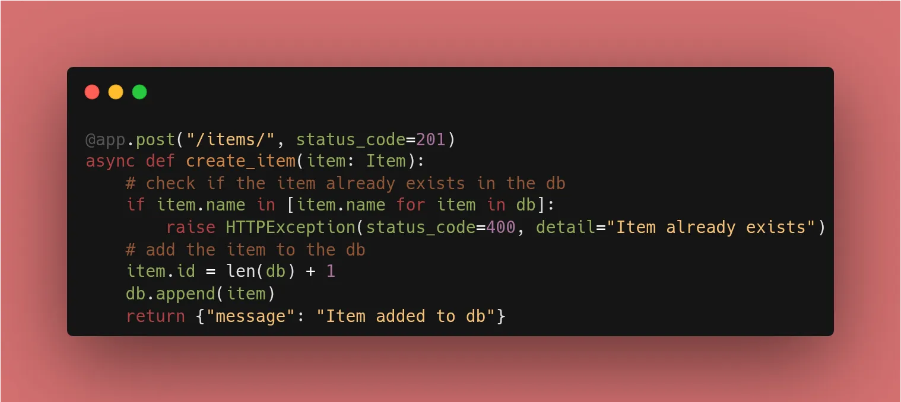
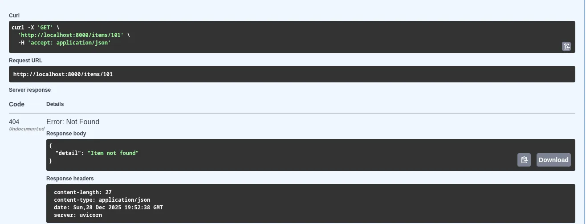

Up until now, our API has been a bit too "polite"—even when an item was missing, it returned a `200 OK` status with an "Item not found" message. Today, we fix that by using **HTTP Exceptions**.

## 1. Setting the "Success" Code

By default, FastAPI returns `200 OK`. For a `POST` request that creates data, the industry standard is `201 Created`.

```python
@app.post("/items/", status_code=201)
async def create_item(item: Item):
    # logic here...
    return {"message": "Item added to db"}

```



## 2. Raising Proper Errors

When something goes wrong, we use `HTTPException`. This is a clean way to "exit" your function and send an error back to the user.

```python
from fastapi import HTTPException

@app.get("/items/{item_id}", response_model=ItemResponse)
async def read_item(item_id: int):
    item = next((item for item in db if item.id == item_id), None)
    
    if item is None:
        # Instead of returning a message, RAISE an error
        raise HTTPException(status_code=404, detail="Item not found")
        
    # ... logic continues for found items

```

## 3. Why This Matters

1. **Frontend Integration:** A developer can write `if (response.status === 404)` instead of searching through text strings.
2. **Security:** Proper status codes (like `401 Unauthorized` or `403 Forbidden`) are essential for building secure systems later in this challenge.
3. **Documentation:** Swagger UI automatically lists these potential error codes so users know what to expect.

## 🛠️ Implementation Checklist

* [x] Updated `@app.post` to return `status_code=201`.
* [x] Replaced "Item not found" return logic with `raise HTTPException(status_code=404)`.
* [x] Verified in Swagger UI that the "Response" section now shows the 404 status.

---

## 📚 Resources

1. **Official Docs:** [FastAPI Handling Errors](https://fastapi.tiangolo.com/tutorial/handling-errors/)
2. **Book:** *FastAPI: Modern Python Web Development* (Chapter 4: Error Handling).
3. **Video:** FreeCodeCamp FastAPI Course (~1h 05m mark) where Beau discusses Status Codes.

---

## More About HTTP Status Codes

Status codes are three-digit numbers issued by a server in response to a client's request2. They inform the client about the status of the request and are generally classified into five categories3:

|**Code**|**Description**|
|---|---|
|**1XX (Informational):**|The request was received and the process is continuing.|
|**2XX (Success):**|The action was successfully received, understood, and accepted.|
|**3XX (Redirection):**|Further action must be taken to complete the request (e.g., the page moved).|
|**4XX (Client Error):**|The request contains bad syntax or cannot be fulfilled (e.g., a resource is missing).|
|**5XX (Server Error):**|The server failed to fulfill an apparently valid request.|


### Common Codes in FastAPI

While **200 OK** is the default for most operations in FastAPI, you will frequently use others to follow best practices:

|**Code**|**Description**|
|---|---|
|**201 Created:**|Typically used after a successful `POST` request that results in a new resource being created.|
|**204 No Content:**|Used when a request is successful, but there is no data to return (common for `DELETE` operations).|
|**401 Unauthorized:**|Technically refers to a lack of valid authentication (the server doesn't know who you are).|
|**404 Not Found:**|The most common error, used when a specific resource (like a user ID or item) does not exist in the database.|
|**422 Unprocessable Entity:**|This is often triggered automatically by **Pydantic** when the data sent in the request body does not match the expected model.|

---

## 🌟 Week 1 Complete!

From "Hello World" to a validated, documented, and error-aware API with a mock database.
