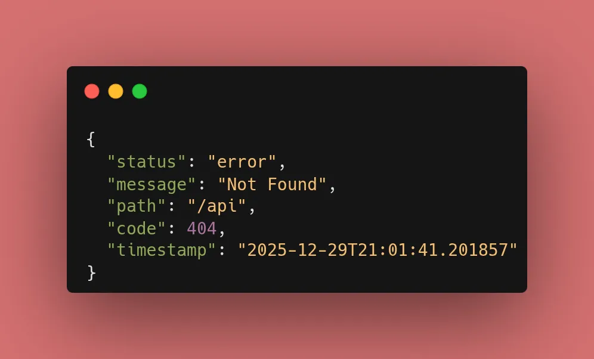

Yesterday, we introduced `HTTPException`. Today, we centralize our error logic. By catching `StarletteHTTPException` (the base class FastAPI uses for its own HTTP exceptions), we can ensure every error follows a strict corporate or project-wide standard.

### 1. The Global Handler Logic

We use the `@app.exception_handler` decorator to intercept exceptions. Notice the addition of the `timestamp`—essential for production logging and client-side troubleshooting.

```python
from fastapi import FastAPI, Request
from fastapi.responses import JSONResponse
from starlette.exceptions import HTTPException as StarletteHTTPException
from datetime import datetime

app = FastAPI()

@app.exception_handler(StarletteHTTPException)
async def custom_http_exception_handler(request: Request, exc: StarletteHTTPException):
    return JSONResponse(
        status_code=exc.status_code,
        content={
            "status": "error",
            "message": exc.detail,
            "path": request.url.path,
            "code": exc.status_code,
            "timestamp": datetime.now().isoformat()
        },
    )

```

### 2. Why `StarletteHTTPException`?

While FastAPI provides its own `HTTPException`, it actually inherits from Starlette's version. Catching the Starlette version ensures you capture a broader range of potential issues while maintaining access to the `status_code` and `detail` attributes.

### 3. Key Improvements Today:

* **`timestamp`**: Provides context on exactly when the error happened.
* **`path`**: Tells the client (and your logs) exactly which URL triggered the failure.
* **Cleaner Logic**: Your individual endpoints no longer need to worry about *how* to format an error; they just `raise` it, and the global handler does the rest.



### 🛠️ Implementation Checklist

* [x] Imported `StarletteHTTPException` and `datetime`.
* [x] Configured the global `@app.exception_handler`.
* [x] Verified that 404 errors now include an ISO-formatted timestamp.
* [x] Confirmed the error JSON structure matches the new "envelope."

---

## 📚 Resources

1. **Official Docs:** [FastAPI Custom Exception Handlers](https://www.google.com/search?q=https://fastapi.tiangolo.com/tutorial/handling-errors/%23install-custom-exception-handlers)
2. **Book:** *FastAPI: Modern Python Web Development* (Chapter 5: Advanced Features).
