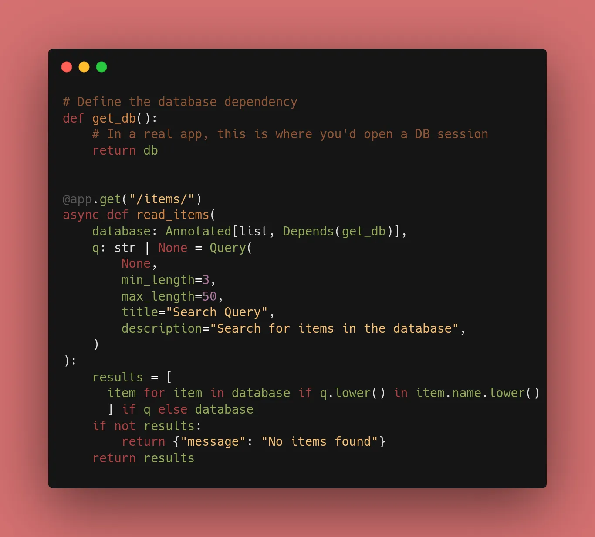
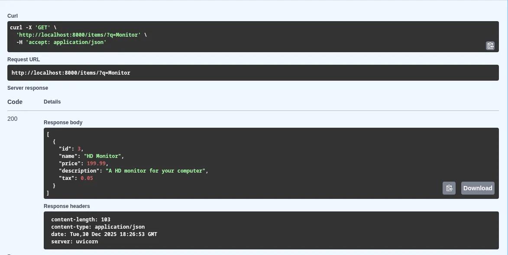

In a small app, you might just use a global variable for your database. But in a real app, that leads to "spaghetti code." Today, I learned how to use FastAPI's `Depends` to manage shared resources.

### 1. What is a Dependency?

A dependency is just a function. FastAPI will run this function **before** your endpoint runs and pass the result into your route.

### 2. Implementation: Injecting the Mock DB

Instead of accessing `db` globally, we can create a dependency that "provides" the database to our routes.

```python
from fastapi import FastAPI, Depends
from typing import Annotated

app = FastAPI()

# 1. Define the dependency
def get_db():
    # In a real app, this is where you'd open a DB session
    return db

# 2. Use it in a route
@app.get("/items/")
async def read_items(database: Annotated[list, Depends(get_db)]):
    return {"data": database}

```

### 3. Why use `Annotated`?

You'll notice I used `Annotated`. This is the modern, recommended way to write FastAPI dependencies. It makes the code more readable and plays nicely with other Python tools (like linters and static analyzers).

### 4. Benefits I Discovered Today:

* **Dry (Don't Repeat Yourself):** If I want to add logging to every database call, I only have to change it in the `get_db` function.
* **Security:** You can use dependencies to check if a user is logged in before the route even begins.
* **Validation:** Dependencies can have their own `Query` and `Path` parameters, meaning they can validate data before it ever reaches your main logic.

### 🛠️ Implementation Checklist

* [x] Created a `get_db` dependency function.
* [x] Refactored the `POST` and `GET` routes to use `Depends(get_db)`.
* [x] Verified that the API still functions exactly as before (but with cleaner code!).
* [x] Explored how dependencies show up in Swagger UI (they look like regular parameters).


---

## 📚 Resources

1. **Official Docs:** [FastAPI Dependencies - First Steps](https://fastapi.tiangolo.com/tutorial/dependencies/)
2. **Book:** *FastAPI: Modern Python Web Development* (Chapter 5: Dependency Injection).
