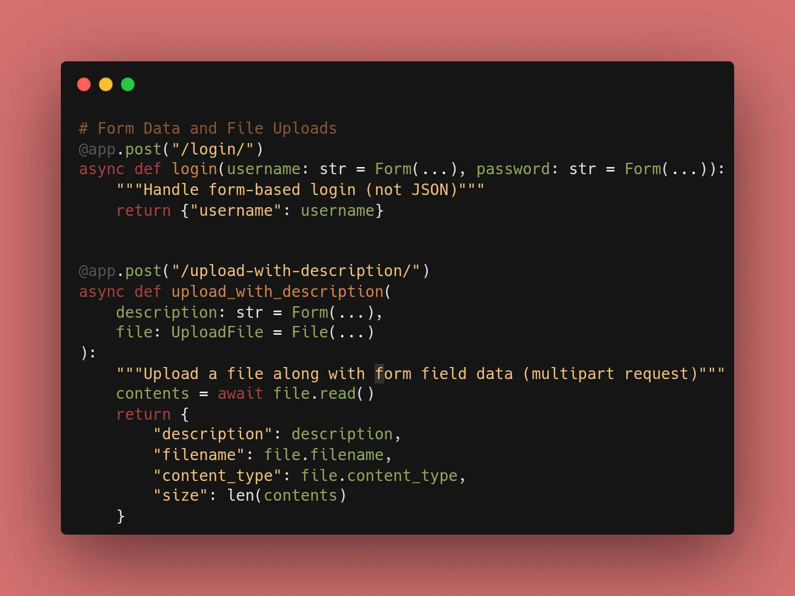
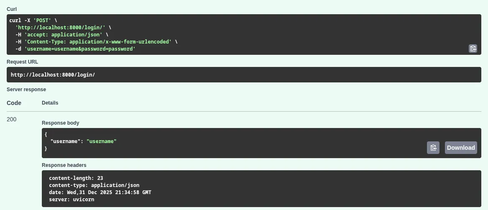
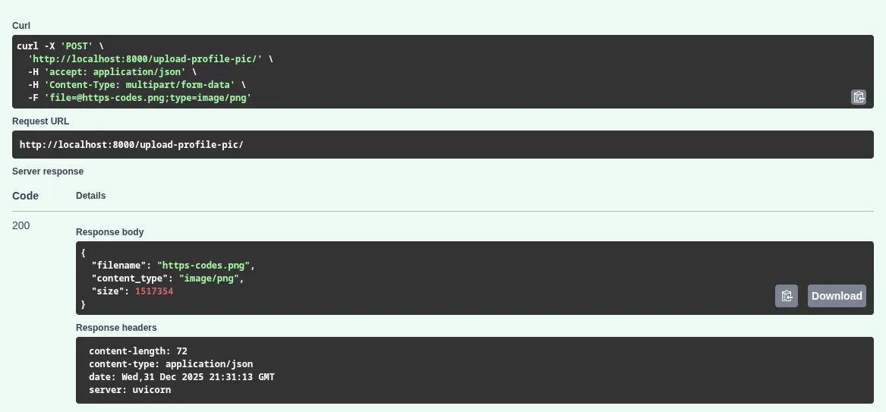

Today is a big shift. You’ve been sending JSON data back and forth, but real-world applications often need to handle **standard HTML forms** and **file uploads** (like profile pictures or CSV reports).

To make this work, ensure you've run `uv add python-multipart` as we discussed yesterday!

---


While JSON is the standard for APIs, many legacy systems and web frontends send data as `form-data`. Today, I implemented endpoints to handle both forms and actual file uploads.

### 1. Handling Form Fields

FastAPI provides the `Form` class to define attributes that should be received as form fields rather than JSON.

```python
from fastapi import FastAPI, Form

app = FastAPI()

@app.post("/login/")
async def login(username: str = Form(...), password: str = Form(...)):
    return {"username": username}

```

### 2. Efficient File Uploads with `UploadFile`

Using `UploadFile` has several advantages over `bytes`:

* **Memory Efficient:** It doesn't load the whole file into RAM immediately.
* **Rich Attributes:** You get easy access to `file.filename` and `file.content_type`.
* **File-like Object:** You can use `await file.read()` or `await file.write()` just like a standard Python file object.

```python
from fastapi import FastAPI, File, UploadFile

@app.post("/upload-profile-pic/")
async def upload_image(file: UploadFile = File(...)):
    contents = await file.read() # Read the file content
    return {
        "filename": file.filename,
        "content_type": file.content_type,
        "size": len(contents)
    }

```


### 3. Mixing Forms and Files

You can even combine them! For example, a user might upload an image and provide a description in the same request. FastAPI handles the parsing of this complex "multipart" request automatically.


### 🛠️ Implementation Checklist

* [x] Installed `python-multipart` using **uv**.
* [x] Created a `POST` endpoint using `Form`.
* [x] Created a `POST` endpoint using `UploadFile`.
* [x] Verified the "File Picker" works in Swagger UI (`/docs`).



---

## 📚 Resources

1. **Official Docs:** [FastAPI Form Data](https://fastapi.tiangolo.com/tutorial/request-forms/)
2. **Official Docs:** [FastAPI Request Files](https://fastapi.tiangolo.com/tutorial/request-files/)
3. **Book:** *FastAPI: Modern Python Web Development* (Chapter 4: Form Data & Files).
