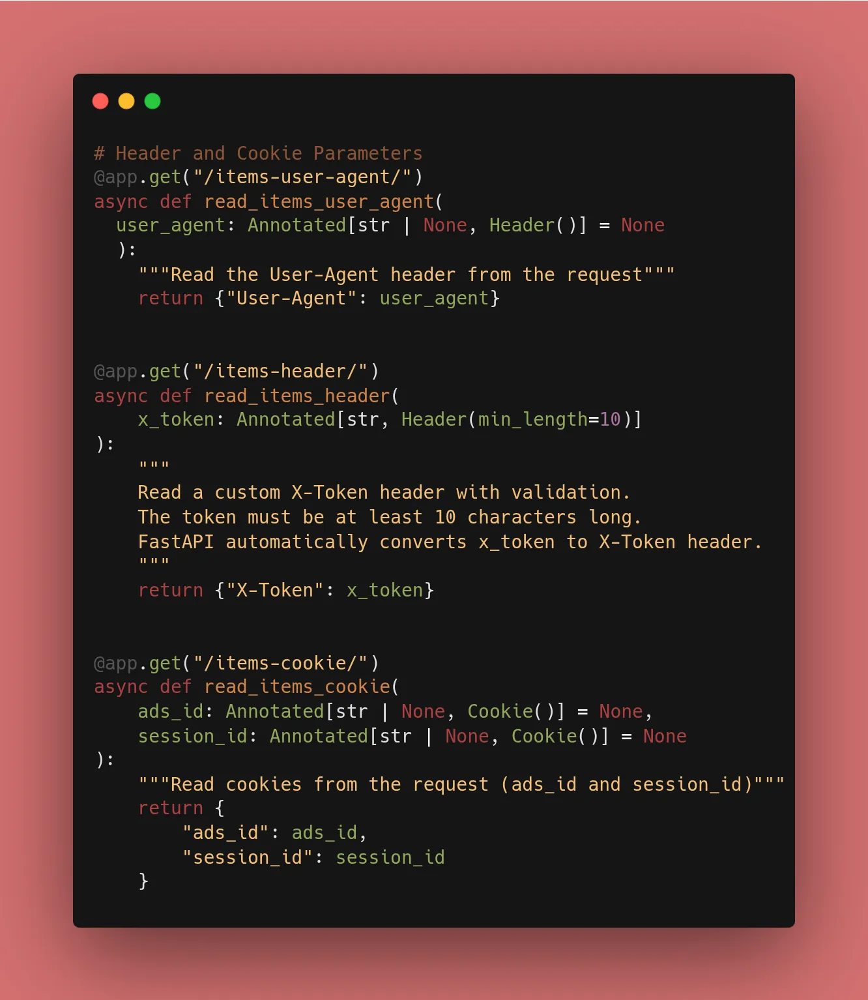
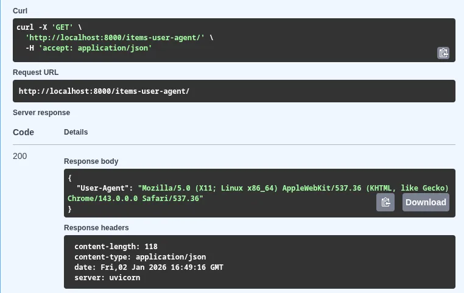
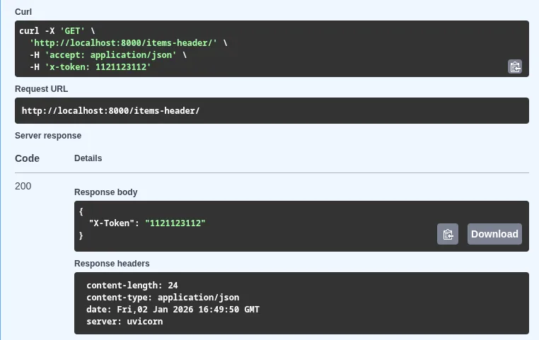
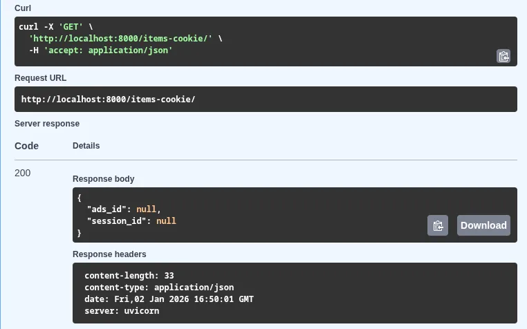

Welcome back! After a short New Year's break, we are exploring how to read data that isn't in the URL or the JSON body. 

While we usually look at the "body" or the "URL" for data, sometimes the most important information is hidden in the **Metadata**. Today is about learning how to extract and validate information from **Headers** (like `User-Agent` or custom API keys) and **Cookies** (like session IDs).

---

## 1. Header Parameters

Headers are used for metadata like authentication tokens (`Authorization`), media types (`Content-Type`), or client info (`User-Agent`).

In FastAPI, you use the `Header` class. A cool feature is that it automatically converts **underscores to hyphens** (e.g., `user_agent` becomes `User-Agent`).

```python
from fastapi import FastAPI, Header
from typing import Annotated

app = FastAPI()

@app.get("/items/")
async def read_items(user_agent: Annotated[str | None, Header()] = None):
    return {"User-Agent": user_agent}

```

## 2. Cookie Parameters

Cookies are small pieces of data stored on the client side. They are essential for tracking sessions or user preferences. Reading them is just as easy as reading a header.

```python
from fastapi import Cookie

@app.get("/items-cookie/")
async def read_items_cookie(ads_id: Annotated[str | None, Cookie()] = None):
    return {"ads_id": ads_id}

```


## 3. Why Validate Metadata?

Sometimes your API requires a custom header (like `X-Token`) to function. By using `Header(..., min_length=10)`, you ensure that your code doesn't even run if the client doesn't provide the correct metadata. This saves processing power and improves security.

## 🛠️ Implementation Checklist

* [x] Created an endpoint to read the `User-Agent`.
* [x] Created an endpoint to read a custom `X-Token` header.
* [x] Experimented with reading a sample cookie.
* [x] Verified that Swagger UI (`/docs`) allows you to input these "hidden" parameters for testing.




---

## 📚 Resources

1. **Official Docs:** [FastAPI Header Parameters](https://fastapi.tiangolo.com/tutorial/header-params/)
2. **Official Docs:** [FastAPI Cookie Parameters](https://fastapi.tiangolo.com/tutorial/cookie-params/)
3. **Book:** *FastAPI: Modern Python Web Development* (Chapter 4: Header & Cookie sections).