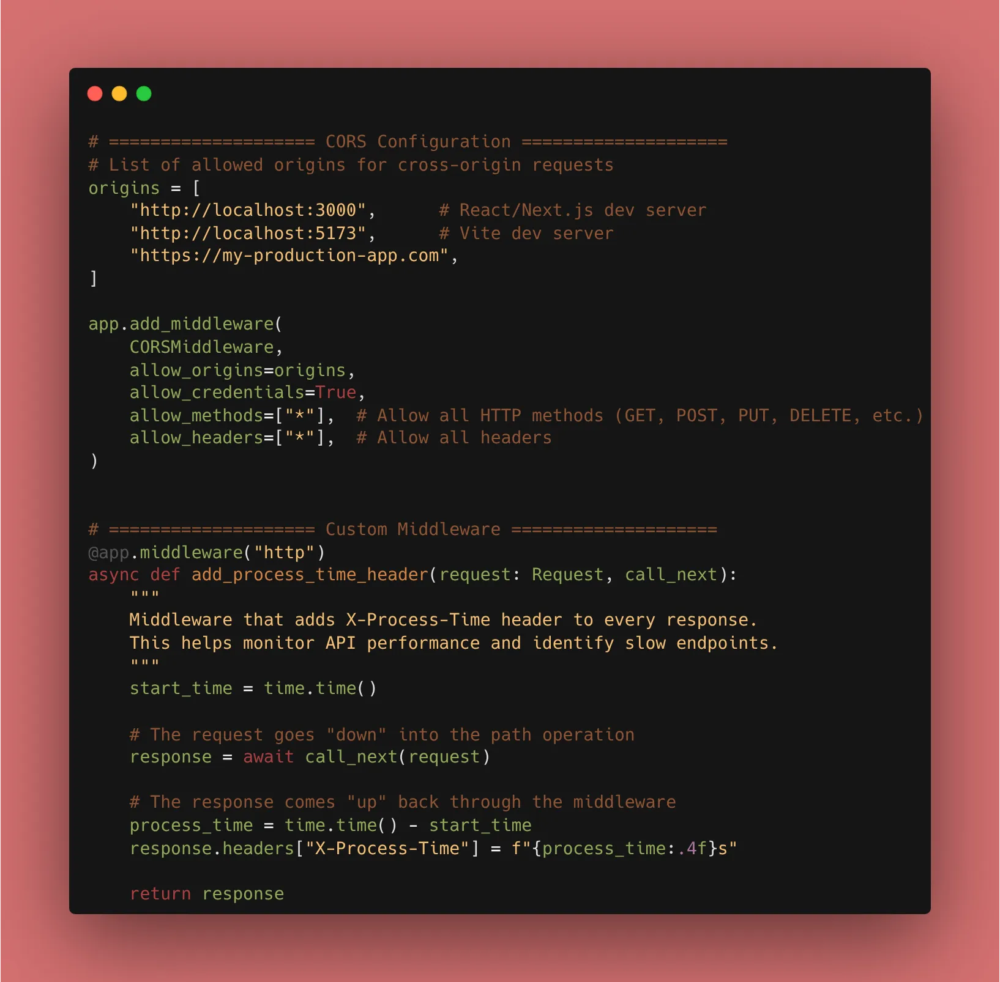
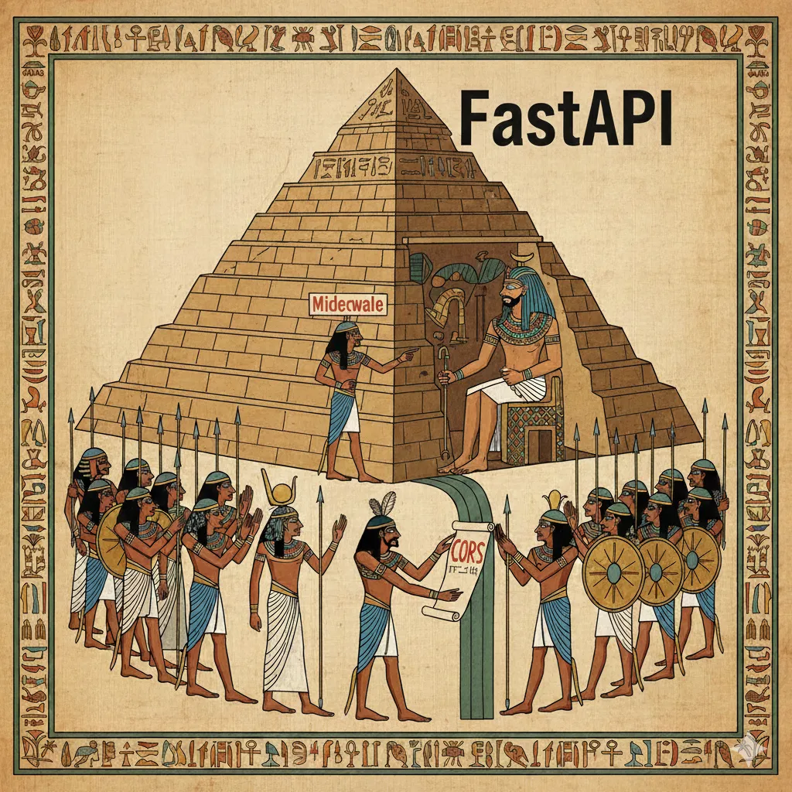

Since we’ve officially caught up, **Day 12** is where we take those headers and cookies we learned about yesterday and apply them globally. We are now automating that logic using **Middleware**.

### 1. What is Middleware?

Middleware is a function that runs for every request before it is processed by any specific path operation, and also for every response before returning it.

A perfect example is adding a "Process Time" header to every response so you can monitor performance:

```python
import time
from fastapi import Request

@app.middleware("http")
async def add_process_time_header(request: Request, call_next):
    start_time = time.time()
    
    # The request goes "down" into the path operation
    response = await call_next(request) 
    
    # The response comes "up" back through the middleware
    process_time = time.time() - start_time
    response.headers["X-Process-Time"] = f"{process_time:.4f}s"
    
    return response

```

### 2. The CORS Headache (and the Fix)

CORS is a browser security mechanism. If your frontend is at `localhost:3000` and your API is at `localhost:8000`, the browser will block the request unless you explicitly permit it.

FastAPI provides a built-in `CORSMiddleware` to handle this gracefully:

```python
from fastapi.middleware.cors import CORSMiddleware

origins = [
    "http://localhost:3000",
    "https://my-production-app.com",
]

app.add_middleware(
    CORSMiddleware,
    allow_origins=origins,
    allow_credentials=True,
    allow_methods=["*"], # Allow GET, POST, etc.
    allow_headers=["*"], # Allow all headers
)

```


### 3. Why This Matters

* **Centralization:** Instead of checking for an `X-API-Key` in every route, you can do it once in a middleware.
* **Standardization:** Ensure every response from your server has the same security headers.
* **Performance:** Track and log slow requests globally without cluttering your business logic.

### 🛠️ Implementation Checklist

* [x] Created a custom timing middleware.
* [x] Configured `CORSMiddleware` with specific allowed origins.
* [x] Verified the `X-Process-Time` header appears in the browser's Network tab.
* [x] Confirmed that the global exception handler from Day 8 still works alongside the middleware.

---

## 📚 Resources

1. **Official Docs:** [FastAPI Middleware](https://fastapi.tiangolo.com/tutorial/middleware/)
2. **Official Docs:** [CORS (Cross-Origin Resource Sharing)](https://fastapi.tiangolo.com/tutorial/cors/)
3. **Book:** *FastAPI: Modern Python Web Development* (Chapter 5: Middleware & Advanced Config).

---

### 💡 What's next for Day 13?

We are ending the "Metadata" phase and entering **Phase 3: Real Databases**. Tomorrow, we say goodbye to our `db.json` and start setting up **SQLAlchemy** to talk to a real SQL database!

