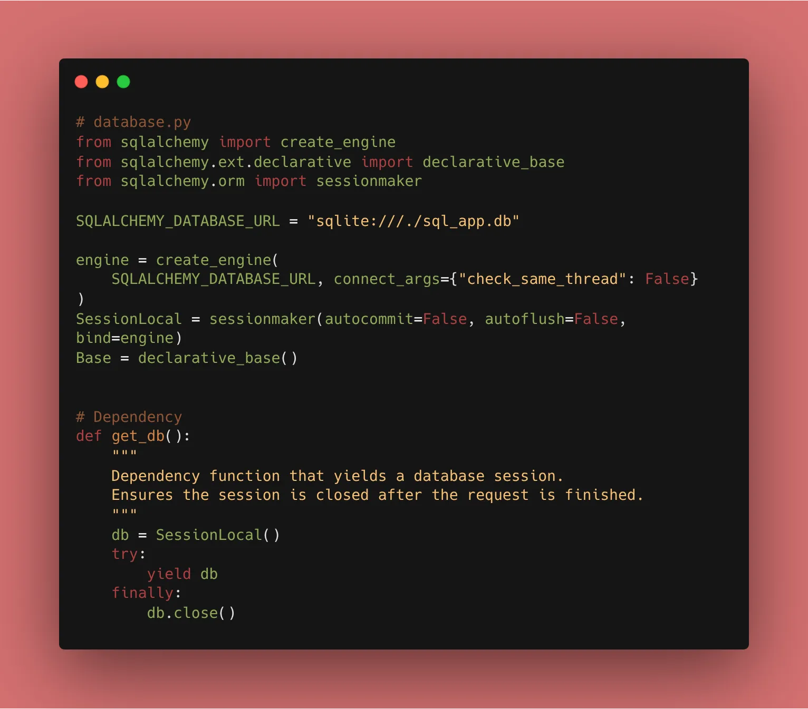
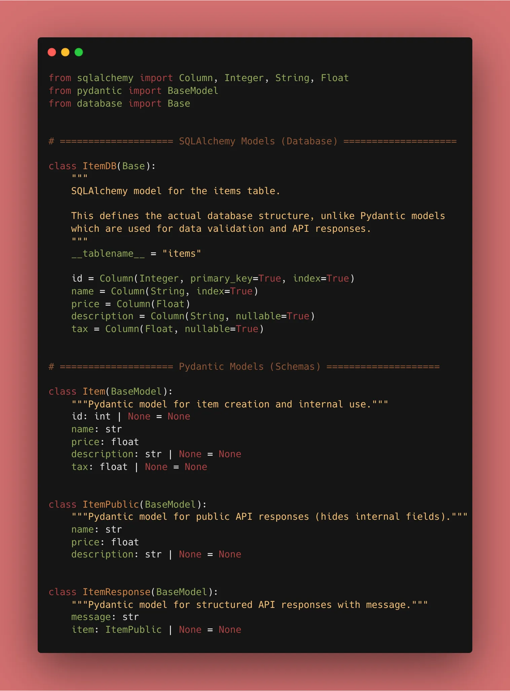

Today, we replace our local `db.json` with a **SQLite** database using **SQLAlchemy**.

### 1. What is an ORM?

An **Object-Relational Mapper (ORM)** allows you to interact with your database using Python classes instead of writing raw SQL (like `SELECT * FROM items`).

### 2. Setting Up the Engine

First, we need to install the tools. With **uv**, it’s a single command:

```bash
uv add sqlalchemy

```

Then, we create the `database.py` file to handle our connection:

```python
from sqlalchemy import create_engine
from sqlalchemy.ext.declarative import declarative_base
from sqlalchemy.orm import sessionmaker

SQLALCHEMY_DATABASE_URL = "sqlite:///./sql_app.db"

engine = create_engine(
    SQLALCHEMY_DATABASE_URL, connect_args={"check_same_thread": False}
)
SessionLocal = sessionmaker(autocommit=False, autoflush=False, bind=engine)

Base = declarative_base()

```


### 3. Creating the Database Model

This looks similar to a Pydantic model, but it serves a different purpose: it tells the database how to create the table.

```python
from sqlalchemy import Column, Integer, String, Float
from .database import Base

class ItemDB(Base):
    __tablename__ = "items"

    id = Column(Integer, primary_key=True, index=True)
    name = Column(String, index=True)
    price = Column(Float)
    description = Column(String, nullable=True)

```


### 4. Why the separation?

Now we have **three** types of models:

1. **SQLAlchemy Models:** For the Database structure.
2. **Pydantic Models (Schemas):** For data validation and API responses.
3. **Response Models:** For what the user actually sees.

This separation keeps your code clean and prevents your database structure from being leaked to the public!

### 🛠️ Implementation Checklist

* [x] Installed `sqlalchemy` using **uv**.
* [x] Configured the `engine` and `SessionLocal`.
* [x] Defined the `Base` and the `ItemDB` model.
* [x] Verified that `sql_app.db` is created when the app starts.

---

## 📚 Resources

1. **Official Docs:** [FastAPI SQL (Relational) Databases](https://fastapi.tiangolo.com/tutorial/sql-databases/)
2. **Book:** *FastAPI: Modern Python Web Development* (Chapter 6: Working with Databases).
