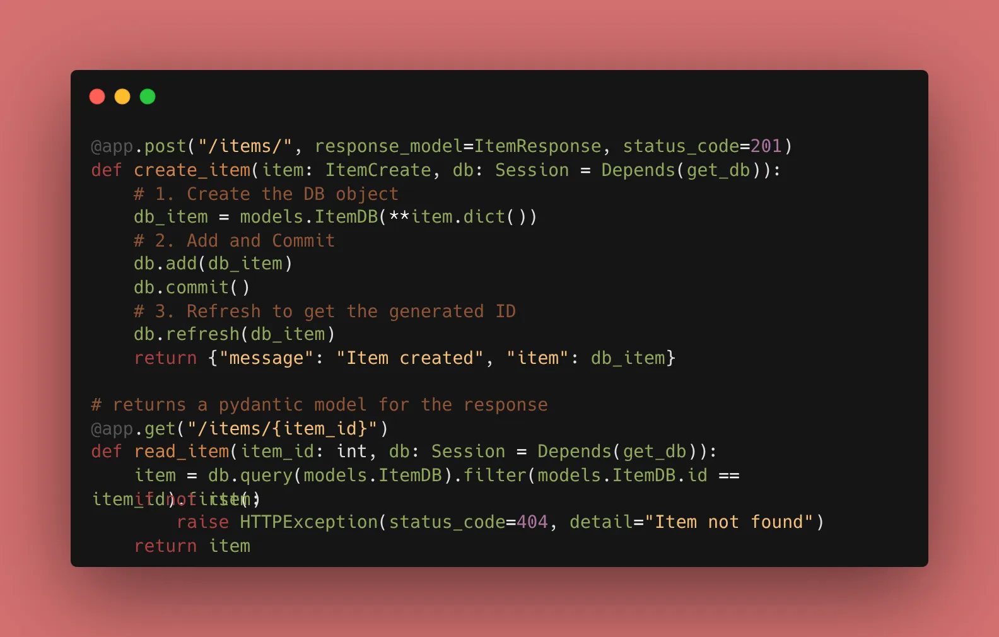

We are turning our SQLAlchemy models into actual data. Today, we focus on the workflow of interacting with a database session.

### 1. The Database Session Dependency

We don't want to leave database connections open forever. We use a "yield" dependency to open a session and automatically close it after the response is sent.

```python
from .database import SessionLocal

def get_db():
    db = SessionLocal()
    try:
        yield db
    finally:
        db.close()

```

### 2. The "Create" Logic

When we receive data via a Pydantic model, we "map" it to our SQLAlchemy model, add it to the session, and commit it.

```python
@app.post("/items/", response_model=ItemResponse, status_code=201)
def create_item(item: ItemCreate, db: Session = Depends(get_db)):
    # 1. Create the DB object
    db_item = models.ItemDB(**item.dict())
    # 2. Add and Commit
    db.add(db_item)
    db.commit()
    # 3. Refresh to get the generated ID
    db.refresh(db_item)
    return {"message": "Item created", "item": db_item}

```

### 3. The "Read" Logic (Fetching Data)

SQLAlchemy makes querying simple. We can fetch one item by ID or many items at once using `.offset()` and `.limit()`.

```python
@app.get("/items/{item_id}")
def read_item(item_id: int, db: Session = Depends(get_db)):
    item = db.query(models.ItemDB).filter(models.ItemDB.id == item_id).first()
    if not item:
        raise HTTPException(status_code=404, detail="Item not found")
    return item

```


### 🛠️ Implementation Checklist

* [x] Created the `get_db` dependency.
* [x] Implemented the `POST` route to save data to SQLite.
* [x] Implemented the `GET` route to fetch data by ID.
* [x] Verified that data persists even after restarting the FastAPI server.
* [x] Confirmed the `response_model` is still filtering out internal fields correctly.

---

## 📚 Resources

1. **Official Docs:** [FastAPI SQL Databases - CRUD](https://www.google.com/search?q=https://fastapi.tiangolo.com/tutorial/sql-databases/%23crud-utils)
2. **Book:** *FastAPI: Modern Python Web Development* (Chapter 6: CRUD Operations).

