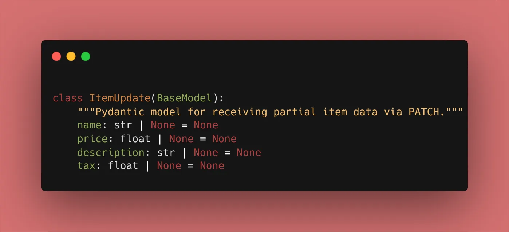
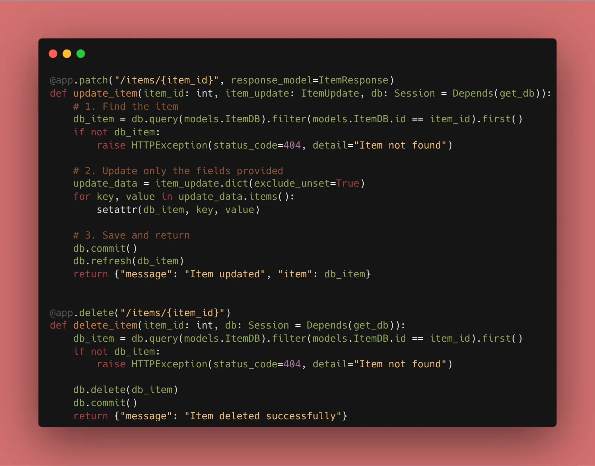

On **Day 15**, we complete the full lifecycle of data management. We are finishing our **CRUD** (Create, Read, Update, Delete) implementation.

Today, we focus on the "U" and the "D." We’ll learn how to modify existing records and how to safely remove them from the database, while also exploring the difference between a full update (**PUT**) and a partial update (**PATCH**).



### 1. Updating Data (The PATCH method)

While `PUT` is used to replace a resource entirely, `PATCH` is used for partial updates. This is more efficient because it reduces the amount of data sent over the network.

```python
@app.patch("/items/{item_id}", response_model=ItemResponse)
def update_item(item_id: int, item_update: ItemUpdate, db: Session = Depends(get_db)):
    # 1. Find the item
    db_item = db.query(models.ItemDB).filter(models.ItemDB.id == item_id).first()
    if not db_item:
        raise HTTPException(status_code=404, detail="Item not found")
    
    # 2. Update only the fields provided
    update_data = item_update.dict(exclude_unset=True)
    for key, value in update_data.items():
        setattr(db_item, key, value)
    
    # 3. Save and return
    db.commit()
    db.refresh(db_item)
    return {"message": "Item updated", "item": db_item}

```

### 2. Deleting Data

Deleting a record is straightforward, but it’s critical to verify the record exists first to avoid database errors.

```python
@app.delete("/items/{item_id}")
def delete_item(item_id: int, db: Session = Depends(get_db)):
    db_item = db.query(models.ItemDB).filter(models.ItemDB.id == item_id).first()
    if not db_item:
        raise HTTPException(status_code=404, detail="Item not found")
    
    db.delete(db_item)
    db.commit()
    return {"message": "Item deleted successfully"}

```



### 3. Soft Delete vs. Hard Delete

Today I learned that in production, we often use **Soft Deletes**. Instead of removing the row, we add a `is_deleted` column. This prevents accidental data loss and keeps a history for audits. For this challenge, we are using **Hard Deletes** (removing the row) to keep things simple.

### 🛠️ Implementation Checklist

* [x] Implemented a `PATCH` endpoint for partial updates.
* [x] Implemented a `DELETE` endpoint.
* [x] Used `exclude_unset=True` in Pydantic to handle partial updates correctly.
* [x] Verified that deleted items no longer appear in the `GET /items/` list.

---

## 📚 Resources

1. **Official Docs:** [FastAPI Update Data](https://fastapi.tiangolo.com/tutorial/body-updates/)
2. **Book:** *FastAPI: Modern Python Web Development* (Chapter 6: Finalizing CRUD).

---


With this, Phase 3 is complete! 