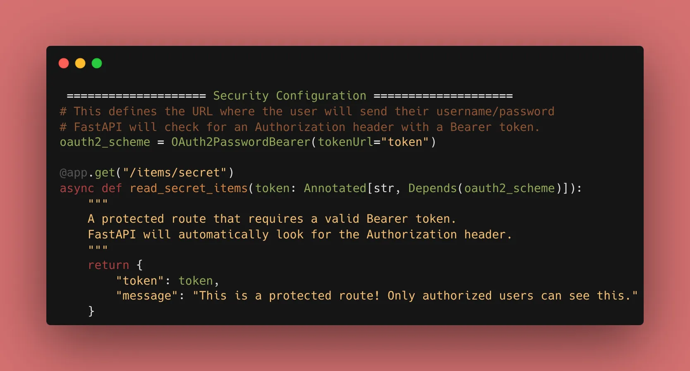
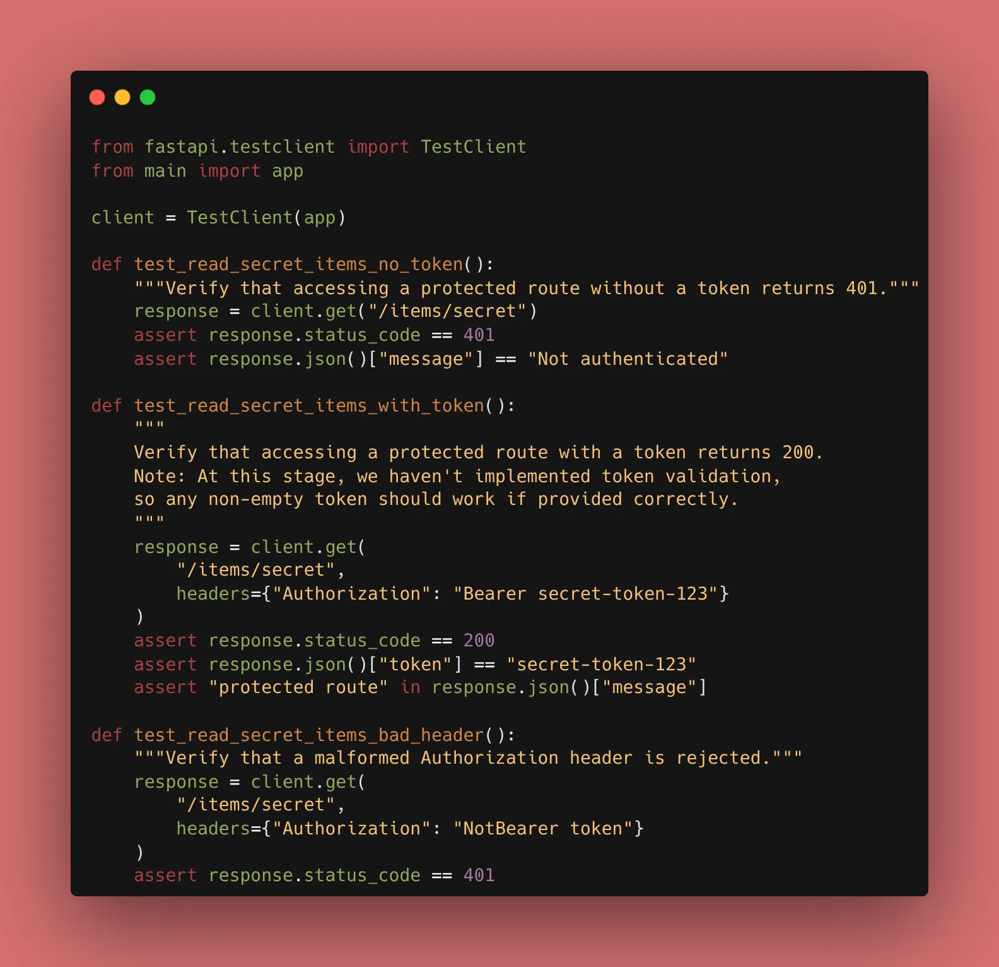
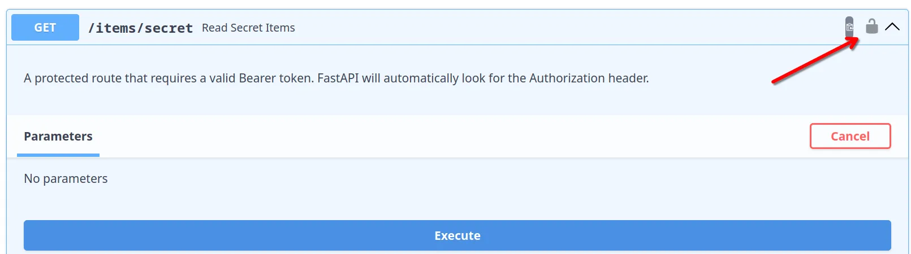

Today, we are moving into the most critical part of backend development: **Security**. Today, we integrated the standard OAuth2 "Password Flow."

### 1. The OAuth2 Flow

FastAPI is designed around OAuth2. It provides a utility called `OAuth2PasswordBearer` that looks for an `Authorization` header in the request. If the header is missing or malformed, it automatically returns a `401 Unauthorized` error.

```python
from fastapi import Depends, FastAPI
from fastapi.security import OAuth2PasswordBearer

app = FastAPI()

# This defines the URL where the user will send their username/password
oauth2_scheme = OAuth2PasswordBearer(tokenUrl="token")

@app.get("/items/secret")
async def read_items(token: str = Depends(oauth2_scheme)):
    return {"token": token, "message": "This is a protected route!"}

```




### 2. The Swagger UI "Magic"

One of the best parts of using FastAPI’s security tools is the documentation. Once you add `Depends(oauth2_scheme)`, the Swagger UI (`/docs`) adds a **"Lock" icon** to your endpoints and a global **"Authorize"** button at the top.



### 3. Why Not Plain Passwords?

In a real app, we never send passwords with every request. Instead:

1. User sends **Username/Password** once.
2. Server validates and returns a **Token**.
3. User sends the **Token** in the header for all future requests.
Today, we set up the "Token" expectation.

### 🛠️ Implementation Checklist

* [x] Defined the `oauth2_scheme` using `OAuth2PasswordBearer`.
* [x] Protected a "Secret" route using the security dependency.
* [x] Verified that the "Authorize" button appears in Swagger UI.
* [x] Confirmed that the route returns a `401` when no token is provided.

---

## 📚 Resources

1. **Official Docs:** [FastAPI Security - First Steps](https://fastapi.tiangolo.com/tutorial/security/first-steps/)
2. **Book:** *FastAPI: Modern Python Web Development* (Chapter 7: Security and Authentication).
