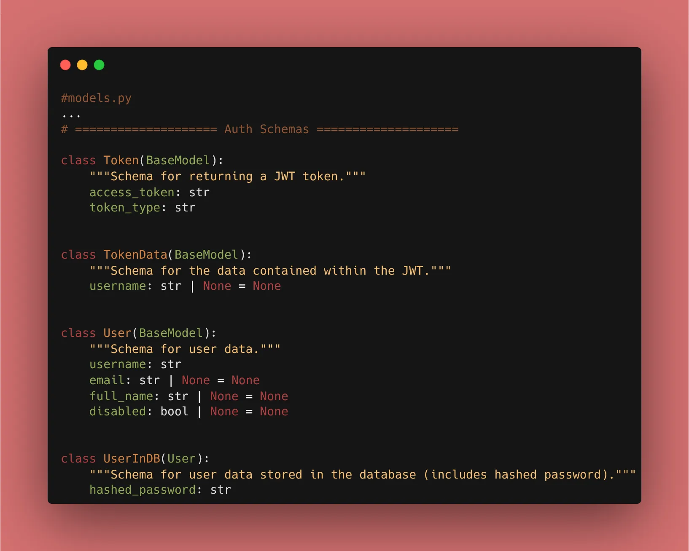
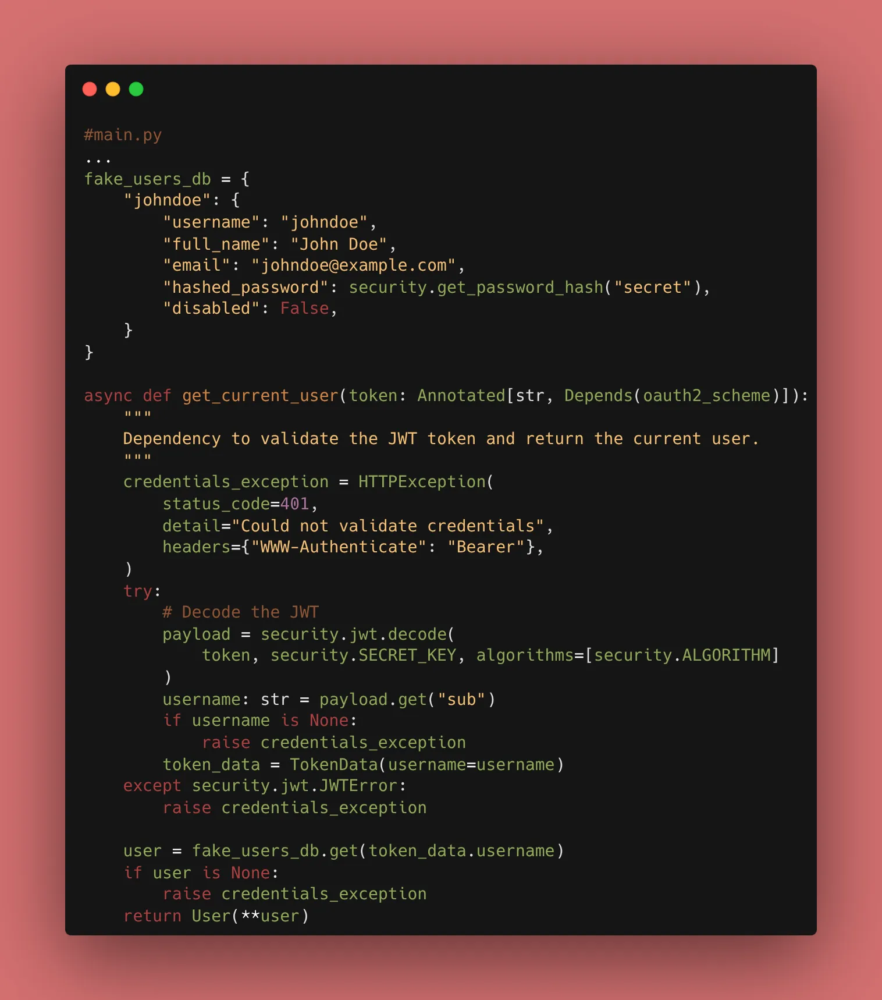
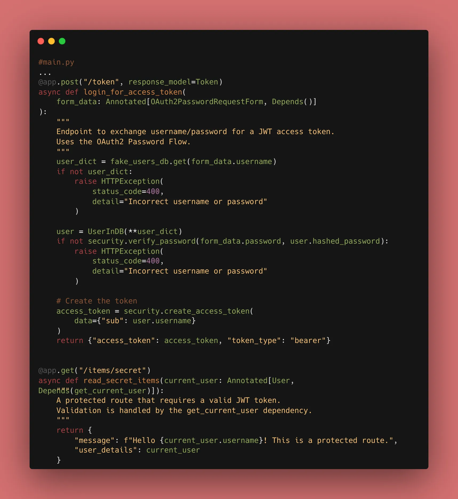
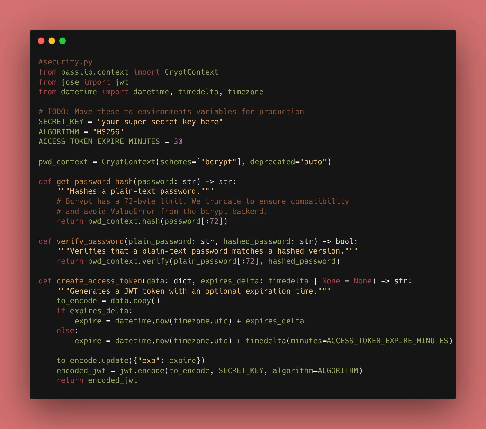
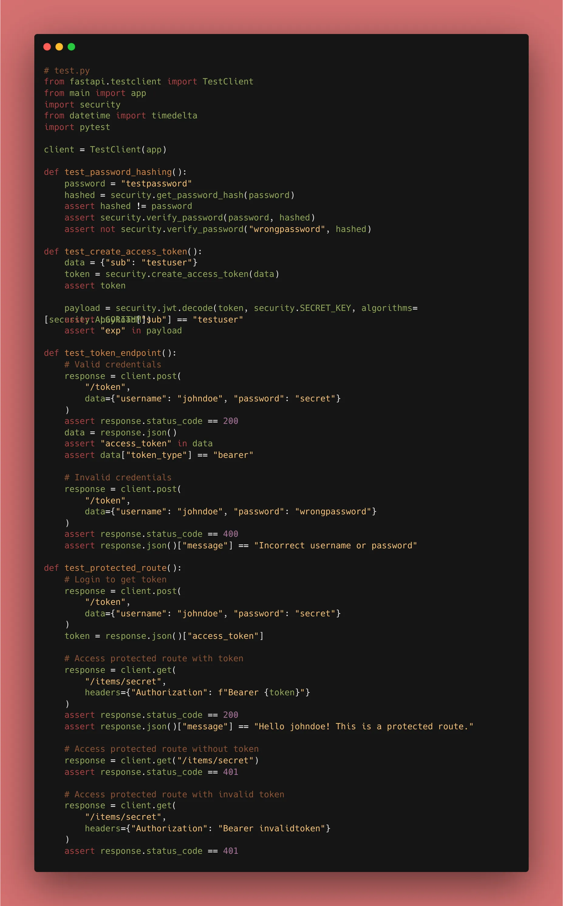

Ok, now we are getting into the deep end. We are building the logic that makes our authentication "real." We have two goals: protect stored passwords and issue secure session tokens.

### 1. Secure Password Hashing

Storing a password as "password123" in a database is a disaster waiting to happen. We use `passlib` to "hash" it—a one-way transformation that is impossible to reverse.

```python
from passlib.context import CryptContext

pwd_context = CryptContext(schemes=["bcrypt"], deprecated="auto")

def get_password_hash(password):
    # Note: Bcrypt has a 72-byte limit. In our implementation,
    # we ensured compatibility by handling library backends correctly.
    return pwd_context.hash(password)

def verify_password(plain_password, hashed_password):
    return pwd_context.verify(plain_password, hashed_password)

```

### 2. Generating JWT Tokens

A JWT is a signed string that contains "claims" (like user ID and expiry). Because it’s signed with a **SECRET_KEY**, the client cannot change the data without breaking the signature.

```python
from jose import jwt
from datetime import datetime, timedelta, timezone

SECRET_KEY = "your-super-secret-key-here"  # TODO: Move to .env
ALGORITHM = "HS256"

def create_access_token(data: dict, expires_delta: timedelta | None = None):
    to_encode = data.copy()
    # modern way: use timezone-aware datetimes
    expire = datetime.now(timezone.utc) + (expires_delta or timedelta(minutes=15))
    to_encode.update({"exp": expire})
    return jwt.encode(to_encode, SECRET_KEY, algorithm=ALGORITHM)

```



### 3. Why JWT?

Unlike session cookies, JWTs are **stateless**. The server doesn't need to remember every logged-in user in its memory; it just validates the token's signature. This makes your API incredibly easy to scale.

### ⚠️ Troubleshooting: The "72-Byte Limit" Bug

While implementing this, you might run into a `ValueError: password cannot be longer than 72 bytes` during testing. This often happens because of a conflict between the `bcrypt` library and `passlib`'s internal wrap-detection.

**The Fix:**
Uninstall the standalone `bcrypt` library and let `passlib` use its built-in implementation, or ensure you aren't passing massive strings to the hashing function. In our case, running `uv remove passlib && uv add passlib` (without the `[bcrypt]` extra) solved the issue while maintaining secure hashing.



### 🛠️ Implementation Checklist

* [x] Installed `passlib` and `python-jose[cryptography]` using **uv**.
* [x] Created `security.py` for hashing and verifying passwords.
* [x] Implemented the `create_access_token` function with `timezone.utc`.
* [x] Updated the `/token` endpoint to return a real JWT.
* [x] Successfully bypassed the bcrypt backend 72-byte limit bug.


---

## 📚 Resources

1. **Official Docs:** [FastAPI OAuth2 with Password and Bearer](https://fastapi.tiangolo.com/tutorial/security/oauth2-jwt/)
2. **Book:** *FastAPI: Modern Python Web Development* (Chapter 7: JWT and Password Hashing).