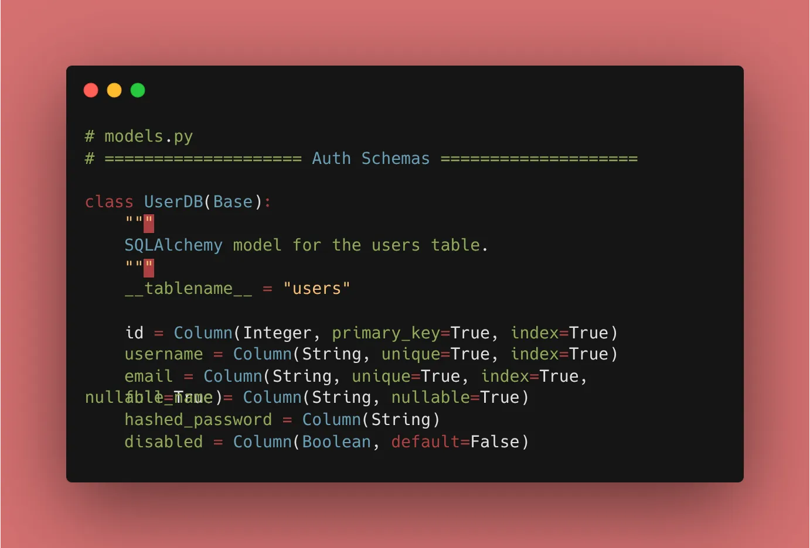
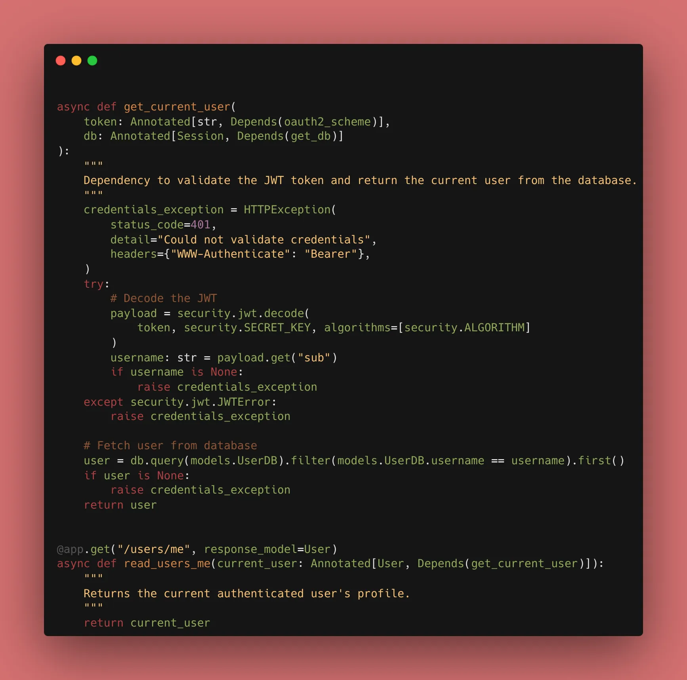
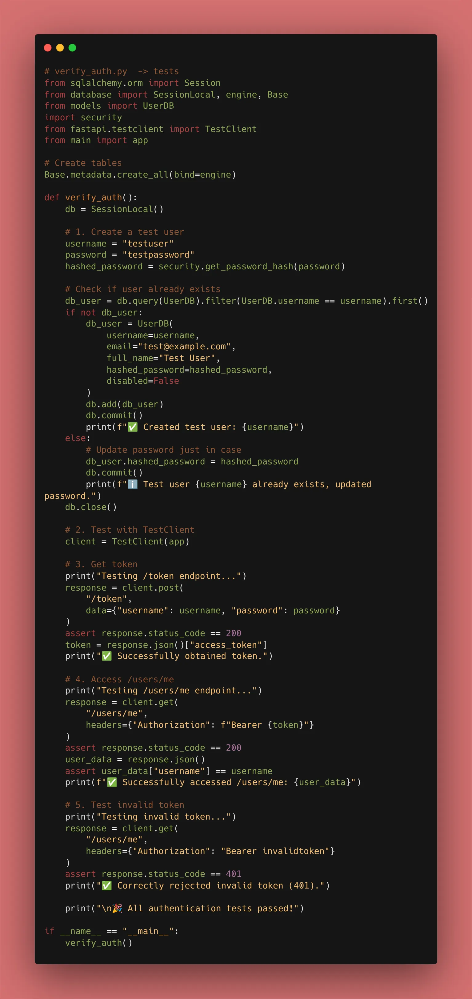

Today, we are putting our security tools to work by identifying the **Current User**.
It’s one thing to have a valid token; it’s another to know exactly *who* is making the request. We build the dependency that decodes the JWT, finds the user in the database, and makes the user object available to any route that needs it.
We’ve hashed passwords and issued JWTs; now we need to turn those JWTs back into User objects.


### 1. The `get_current_user` Dependency

This is the heart of your security. It acts as a gatekeeper for your protected routes.

```python
from jose import JWTError, jwt
from fastapi import Depends, HTTPException, status
from .database import get_db

async def get_current_user(token: str = Depends(oauth2_scheme), db: Session = Depends(get_db)):
    credentials_exception = HTTPException(
        status_code=status.HTTP_401_UNAUTHORIZED,
        detail="Could not validate credentials",
        headers={"WWW-Authenticate": "Bearer"},
    )
    try:
        # 1. Decode the Token
        payload = jwt.decode(token, SECRET_KEY, algorithms=[ALGORITHM])
        username: str = payload.get("sub")
        if username is None:
            raise credentials_exception
    except JWTError:
        raise credentials_exception
        
    # 2. Fetch User from DB
    user = db.query(models.User).filter(models.User.username == username).first()
    if user is None:
        raise credentials_exception
    return user

```

### 2. Using the Dependency in Routes

Now, protecting a route is a one-liner. You don't have to write any decoding logic in your actual business functions.

```python
@app.get("/users/me")
async def read_users_me(current_user: Annotated[User, Depends(get_current_user)]):
    return current_user

```

### 3. Why Dependency Chaining is a Superpower

FastAPI handles the "tree" of requirements for you. When a request hits `/users/me`:

1. It sees it needs `get_current_user`.
2. `get_current_user` needs `oauth2_scheme` (the token) and `get_db`.
3. FastAPI resolves all of them in order and passes the final `user` object to your function.

### 🛠️ Implementation Checklist

* [x] Created the `get_current_user` function.
* [x] Integrated JWT decoding logic and database lookup.
* [x] Added `Annotated` for cleaner dependency syntax.
* [x] Verified that `/users/me` returns the correct user profile when provided a valid token.
* [x] Confirmed that an expired or tampered token results in a `401 Unauthorized`.


---

## 📚 Resources

1. **Official Docs:** [FastAPI Security - Get Current User](https://fastapi.tiangolo.com/tutorial/security/get-current-user/)
2. **Book:** *FastAPI: Modern Python Web Development* (Chapter 7: Finalizing Authentication).