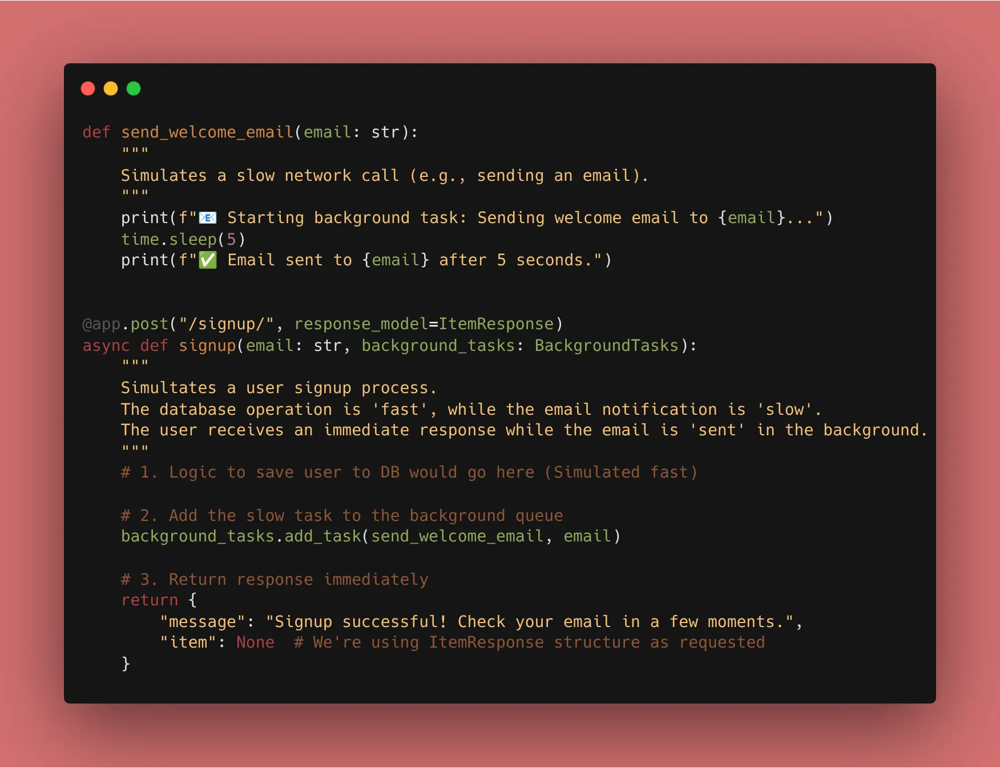
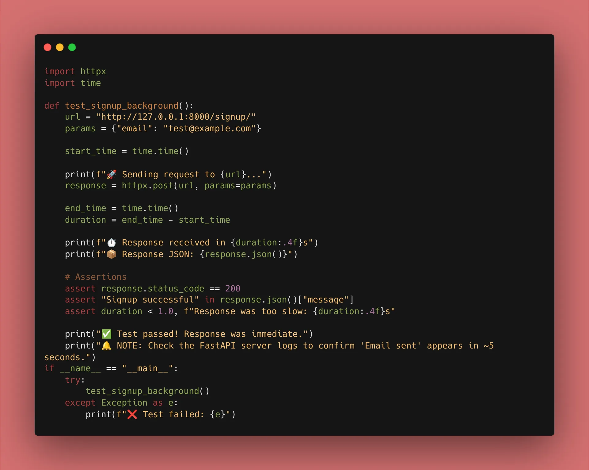

Now we are optimizing our API. Today’s goal: **Zero Latency** for heavy operations.

### 1. The Problem: Blocking Operations

When a user signs up, you might want to:

1. Save them to the DB (Fast).
2. Send a Welcome Email (Slow - 2-3 seconds).
3. Notify an Admin (Slow).

If you do these sequentially, the user waits 5+ seconds. With `BackgroundTasks`, the user waits only for Step 1.

### 2. Implementation: The "Welcome Email"

FastAPI provides a `BackgroundTasks` object that you can inject directly into your path operation function.

```python
from fastapi import BackgroundTasks, FastAPI

app = FastAPI()

def send_welcome_email(email: str):
    # Simulate a slow network call
    import time
    time.sleep(5) 
    print(f"Email sent to {email}")

@app.post("/signup/")
async def signup(email: str, background_tasks: BackgroundTasks):
    # 1. Logic to save user to DB goes here...
    
    # 2. Add the slow task to the background queue
    background_tasks.add_task(send_welcome_email, email)
    
    # 3. Return response immediately
    return {"message": "Signup successful! Check your email in a few moments."}

```


### 3. When to use Background Tasks vs. Celery?

* **Background Tasks:** Great for simple things like sending emails, logging, or updating a local file. It runs within the same Python process.
* **Celery/Redis:** Necessary for "heavy" data processing (like video encoding) or tasks that need to be distributed across multiple servers.

### 4. Integrating with our Starlette Exception Handler

Because we have our custom `StarletteHTTPException` handler from Day 8, we can rest easy knowing that if a background task triggers an error *before* the response is sent, our global handler will still catch it and return our branded JSON.

### 🛠️ Implementation Checklist

* [x] Created a background function to simulate email/logging.
* [x] Injected `BackgroundTasks` into a `POST` route.
* [x] Verified in the terminal that the "Success" message appears in the browser immediately, while the "Email Sent" print happens 5 seconds later.
* [x] Confirmed that the response still follows our `ItemResponse` structure.



---

## 📚 Resources

1. **Official Docs:** [FastAPI Background Tasks](https://fastapi.tiangolo.com/tutorial/background-tasks/)
2. **Book:** *FastAPI: Modern Python Web Development* (Chapter 8: Performance and Background Tasks).
