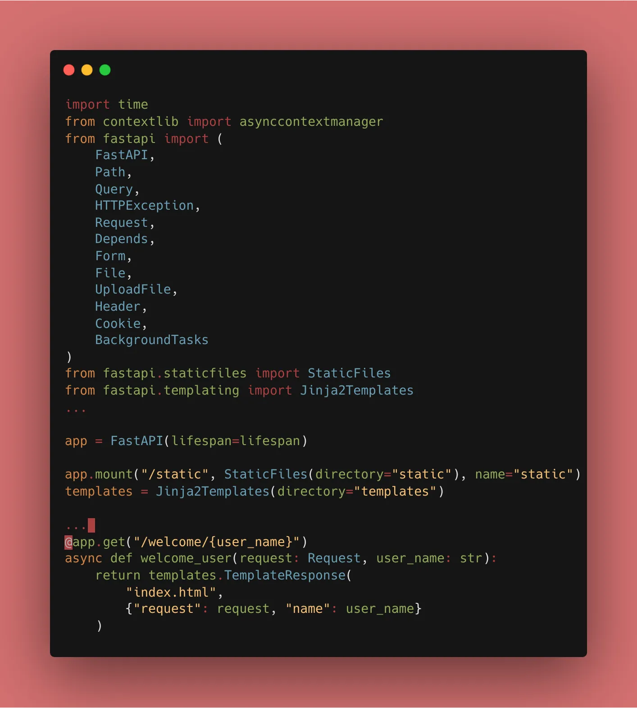
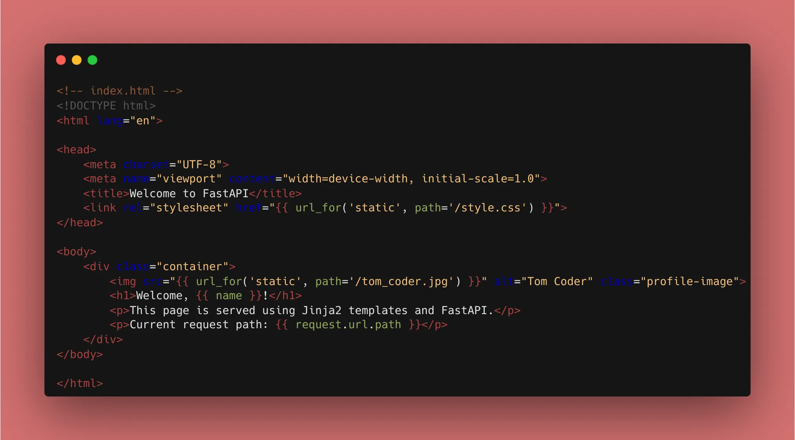
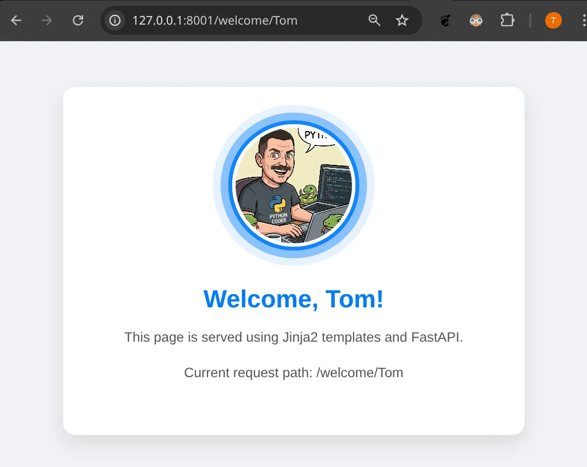

Welcome back! After a short Sunday's break, we are adding a visual layer to our API. Sometimes, you need a simple dashboard or a landing page to show off your work.

### 1. Folder Structure

To keep things clean, we adopt a standard directory structure.

```text
.
├── static/          # CSS, JS, Images
├── templates/       # HTML files (Jinja2)
├── main.py
└── ...

```

### 2. Serving Static Files

FastAPI uses `StaticFiles` from Starlette to "mount" a directory. This makes files like `style.css` accessible at `/static/style.css`.

```python
from fastapi.staticfiles import StaticFiles

app = FastAPI()

app.mount("/static", StaticFiles(directory="static"), name="static")

```



### 3. Rendering HTML with Jinja2

Instead of returning a `dict`, we now return a `TemplateResponse`. This allows us to pass variables from our Python code into our HTML.

```python
from fastapi.templating import Jinja2Templates
from fastapi import Request

templates = Jinja2Templates(directory="templates")

@app.get("/welcome/{user_name}")
async def welcome_user(request: Request, user_name: str):
    return templates.TemplateResponse(
        "index.html", 
        {"request": request, "name": user_name}
    )



### 4. Why the `request` object?

You might notice we pass the `request` in the context. Jinja2 requires this to generate URLs and handle internal logic correctly.

### 🛠️ Implementation Checklist

* [x] Installed `jinja2` using **uv add jinja2**.
* [x] Created `static/` and `templates/` folders.
* [x] Mounted the static directory in `main.py`.
* [x] Created a base HTML template and rendered it via a GET route.
* [x] Verified that my custom Starlette error handler still works (it will still return JSON, which is perfect for API debugging even if the UI fails!).


---

## 📚 Resources

1. **Official Docs:** [FastAPI Static Files](https://fastapi.tiangolo.com/tutorial/static-files/)
2. **Official Docs:** [FastAPI Templates](https://www.google.com/search?q=https://fastapi.tiangolo.com/tutorial/templates/)
3. **Book:** *FastAPI: Modern Python Web Development* (Chapter 9: Templates and Static Files).
