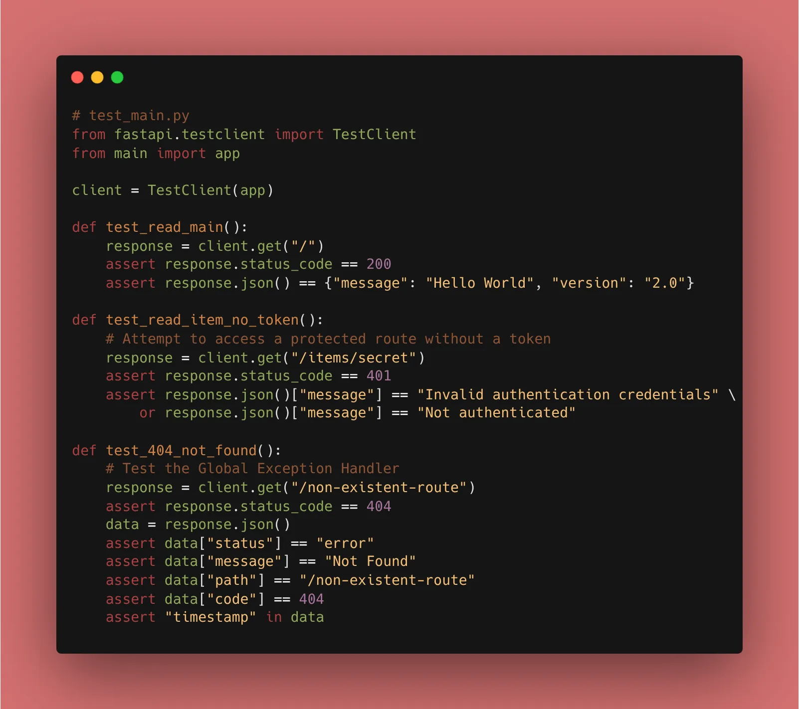
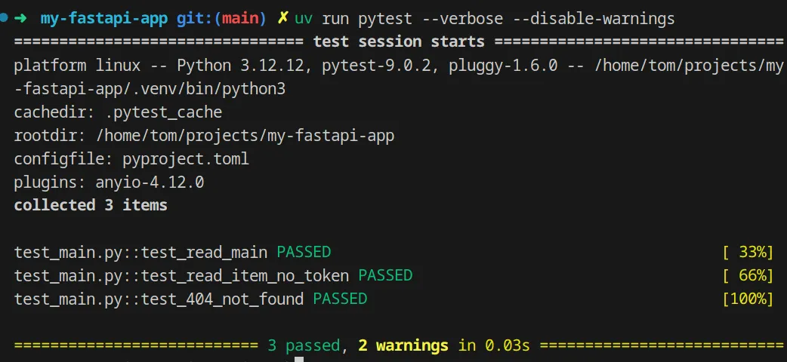

We are entering the world of **Automated Testing**. We want to make sure that when we add a feature on Day 25, we don't accidentally break the Auth logic we wrote on Day 18.

### 1. Setting up the Environment

We use `pytest` as our testing framework and `httpx` (required by FastAPI's TestClient).

```bash
uv add pytest httpx --dev

```

*(Note: I used `--dev` because testing tools shouldn't be bundled in your final production build.)*

### 2. Your First Test Case

We create a new file called `test_main.py`. FastAPI’s `TestClient` allows us to simulate a user visiting our API.

```python
from fastapi.testclient import TestClient
from main import app # Import your FastAPI instance

client = TestClient(app)

def test_read_main():
    # 1. Simulate a GET request
    response = client.get("/")
    
    # 2. Assert the results
    assert response.status_code == 200
    # Updated to match our API versioning
    assert response.json() == {"message": "Hello World", "version": "2.0"}

```

### 3. Testing Protected Routes

Since we implemented **OAuth2** and **JWT** in Phase 4, we need to test how our API handles missing tokens.

```python
def test_read_item_no_token():
    # We use our protected route /items/secret
    response = client.get("/items/secret")
    # We expect a 401 because we haven't logged in in this test!
    assert response.status_code == 401
    # Our custom exception handler returns "message", not "detail"
    assert "Not authenticated" in response.json()["message"] or "Invalid authentication credentials" in response.json()["message"]

```


### 4. Why This Matters

* **Regression Testing:** Every time you run `pytest`, you are verifying that your old code still works.
* **Documentation:** Tests serve as an example of how your API is supposed to be used.
* **Fast Feedback:** You know within seconds if your logic is flawed, rather than waiting for a user to find a bug in production.


### 🛠️ Implementation Checklist

* [x] Installed `pytest` and `httpx` using **uv**.
* [x] Created `test_main.py`.
* [x] Wrote a test for the root (`/`) endpoint.
* [x] Wrote a test to verify that the **Global Exception Handler** (from Day 8) returns the correct JSON format for a 404.
* [x] Ran `pytest` in the terminal and saw the satisfying green dots! ✅

---

## 📚 Resources

1. **Official Docs:** [FastAPI Testing Tutorial](https://fastapi.tiangolo.com/tutorial/testing/)
2. **Pytest Docs:** [Getting Started with Pytest](https://docs.pytest.org/en/stable/getting-started.html)
3. **Book:** *FastAPI: Modern Python Web Development* (Chapter 10: Testing and Debugging).
