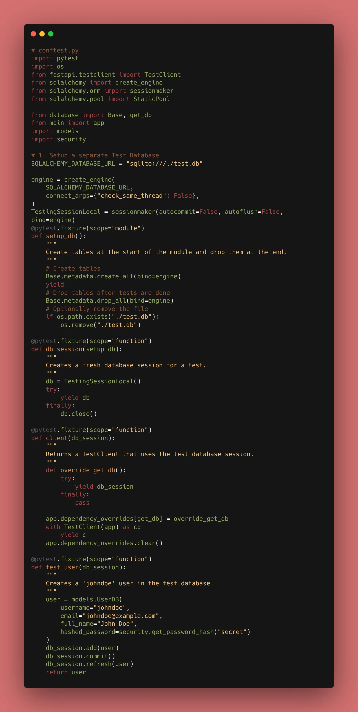
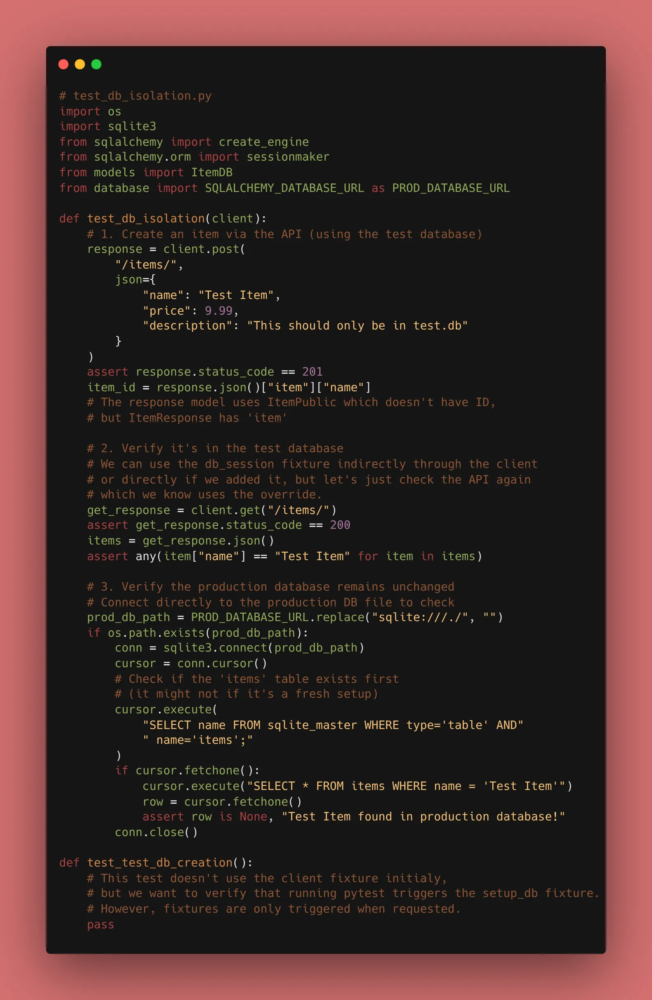
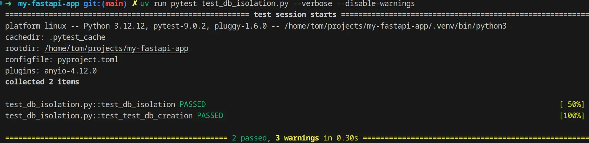

Today, we take testing to the professional level. After a short New Year's break... it's time to learn about **Testing with a Database**.

One of the biggest mistakes developers make is running tests against their production database. Today, we set up a dedicated **Test Database** using Pytest **Fixtures**. This ensures your tests start with a clean slate every single time, without touching your actual data.

We are solving the "Dirty Data" problem. We need our tests to interact with a database, but we don't want them to leave a mess.

### 1. The Strategy: Dependency Overriding

FastAPI allows you to replace a dependency with something else during testing. We will override the `get_db` dependency we created on Day 14.



```python
from main import app
from database import get_db
from sqlalchemy import create_engine
from sqlalchemy.orm import sessionmaker

# 1. Setup a separate Test Database
SQLALCHEMY_DATABASE_URL = "sqlite:///./test.db"
engine = create_engine(
    SQLALCHEMY_DATABASE_URL, 
    connect_args={"check_same_thread": False}
)
TestingSessionLocal = sessionmaker(bind=engine)

# 2. Create the override function
def override_get_db():
    try:
        db = TestingSessionLocal()
        yield db
    finally:
        db.close()

# 3. Apply the override to the app
app.dependency_overrides[get_db] = override_get_db

```

### 2. Using Pytest Fixtures

A fixture is a function that runs before your test to "set the stage." We use it to create the database tables before the tests start and drop them when they finish. In our project, we also ensure the physical file is cleaned up.

```python
import pytest
import os
from database import Base

@pytest.fixture(scope="module")
def setup_db():
    # Create tables
    Base.metadata.create_all(bind=engine)
    yield
    # Drop tables after tests are done
    Base.metadata.drop_all(bind=engine)
    # Cleanup the physical file
    if os.path.exists("./test.db"):
        os.remove("./test.db")

```


### 3. Why `scope="module"`?

By setting the scope to "module," the database is set up once for the entire file rather than for every single test function, which makes your test suite significantly faster.

### 🛠️ Implementation Checklist

* [x] Created a `conftest.py` file to house shared fixtures.
* [x] Implemented `app.dependency_overrides`.
* [x] Wrote a test that creates an item, verifies it's in the DB, and then checks that the *real* `sql_app.db` remains unchanged.
* [x] Verified that running `pytest` automatically creates and deletes `test.db`.


---

## 📚 Resources

1. **Official Docs:** [FastAPI Testing with a Database](https://fastapi.tiangolo.com/advanced/testing-database/)
2. **Pytest Docs:** [About Fixtures](https://docs.pytest.org/en/6.2.x/fixture.html)
3. **Book:** *FastAPI: Modern Python Web Development* (Chapter 10: Advanced Testing).