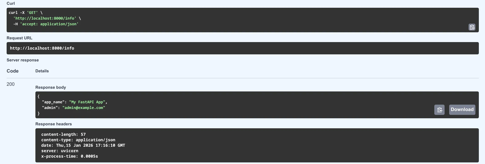

Today we move our project out of the "hobbyist" stage and into the "professional" stage. It's time to talk about **Security and Configuration Management**.

Up until now, we've hardcoded things like our `SECRET_KEY` and Database URLs. Now, we learn how to use **Pydantic Settings** and **.env files** to keep our sensitive data safe and our app configurable for different environments (Development, Testing, Production). If you ever share your code on GitHub, anyone can see your `SECRET_KEY`. Today, we hide it.

## Why Pydantic Settings?

FastAPI is built on Pydantic, so it makes sense to use Pydantic for settings. It gives us:

* **Type Validation:** Ensures your `DATABASE_URL` is a valid string.
* **Default Values:** Provide a local SQLite path by default, but override it with PostgreSQL in production.
* **Environment Priority:** It can read from the OS environment, a `.env` file, or use default values.

## Implementation

### Step 1: Install the Required Library

First, install the required library using **uv**:

```bash
uv add pydantic-settings
```

This installs `pydantic-settings==2.12.0` and its dependency `python-dotenv==1.2.1`.

### Step 2: Create config.py

Create a `config.py` file in your project root:

```python
from pydantic_settings import BaseSettings, SettingsConfigDict


class Settings(BaseSettings):
    """
    Application settings loaded from environment variables or .env file.
    
    This provides type-safe configuration management with validation.
    Settings are loaded in this priority order:
    1. Environment variables
    2. .env file
    3. Default values (if specified)
    """
    app_name: str = "My FastAPI App"
    admin_email: str
    items_per_user: int = 20
    secret_key: str
    database_url: str = "sqlite:///./sql_app.db"
    algorithm: str = "HS256"
    access_token_expire_minutes: int = 30

    # This tells Pydantic to read from a .env file
    model_config = SettingsConfigDict(env_file=".env")


# Singleton instance - import this in your app
settings = Settings()
```

### Step 3: Create the .env File

Create a file named `.env` in your root directory (and add it to your `.gitignore` immediately!):

```env
ADMIN_EMAIL="admin@example.com"
SECRET_KEY="your-super-ultra-secret-key-change-this-in-production"
ITEMS_PER_USER=50
```

**Important:** Add `.env` to your `.gitignore`:

```gitignore
# Environment variables
.env
```

### Step 4: Create .env.example

Create a template file for other developers:

```env
# Environment Configuration Template
# Copy this file to .env and fill in your actual values

# Required Settings
ADMIN_EMAIL="admin@example.com"
SECRET_KEY="your-secret-key-here"

# Optional Settings (defaults shown)
ITEMS_PER_USER=50
DATABASE_URL="sqlite:///./sql_app.db"
ALGORITHM="HS256"
ACCESS_TOKEN_EXPIRE_MINUTES=30
```

### Step 5: Update security.py

Replace hardcoded constants with settings:

```python
from passlib.context import CryptContext
from jose import jwt
from datetime import datetime, timedelta, timezone
from config import settings

pwd_context = CryptContext(schemes=["bcrypt"], deprecated="auto")

def create_access_token(data: dict, expires_delta: timedelta | None = None) -> str:
    """Generates a JWT token with an optional expiration time."""
    to_encode = data.copy()
    if expires_delta:
        expire = datetime.now(timezone.utc) + expires_delta
    else:
        expire = datetime.now(timezone.utc) + timedelta(minutes=settings.access_token_expire_minutes)
    
    to_encode.update({"exp": expire})
    encoded_jwt = jwt.encode(to_encode, settings.secret_key, algorithm=settings.algorithm)
    return encoded_jwt
```

### Step 6: Update database.py

Replace hardcoded database URL:

```python
from sqlalchemy import create_engine
from sqlalchemy.ext.declarative import declarative_base
from sqlalchemy.orm import sessionmaker
from config import settings

engine = create_engine(
    settings.database_url, connect_args={"check_same_thread": False}
)
SessionLocal = sessionmaker(autocommit=False, autoflush=False, bind=engine)
Base = declarative_base()
```

### Step 7: Update main.py

Import settings and use them in your app:

```python
from config import settings

# In get_current_user dependency
payload = security.jwt.decode(
    token, settings.secret_key, algorithms=[settings.algorithm]
)

# Add a demo endpoint
@app.get("/info")
async def get_info():
    """
    Demonstrates how to use settings in your application.
    Returns app name and admin email from environment configuration.
    """
    return {"app_name": settings.app_name, "admin": settings.admin_email}
```

## Using Settings in Your App

You can now import `settings` anywhere in your app. It's a clean, singleton-style object.

```python
from config import settings

@app.get("/info")
async def get_info():
    return {"app_name": settings.app_name, "admin": settings.admin_email}
```

## Testing

All existing tests should pass without modification:

```bash
uv run pytest -v
```

Test that settings are loaded correctly:

```bash
uv run python -c "from config import settings; print(f'App: {settings.app_name}')"
```



## 🛠️ Implementation Checklist

* [x] Installed `pydantic-settings` via **uv**.
* [x] Created a `Settings` class inheriting from `BaseSettings`.
* [x] Moved `SECRET_KEY` and `DATABASE_URL` from source files to `.env`.
* [x] Added `.env` to `.gitignore`.
* [x] Created a `.env.example` as a template for other developers.
* [x] Updated `security.py` to use settings.
* [x] Updated `database.py` to use settings.
* [x] Updated `main.py` to use settings.
* [x] Added `/info` endpoint to demonstrate settings.
* [x] All tests pass successfully.

## 📚 Resources

1. **Official Docs:** [FastAPI Settings and Environment Variables](https://fastapi.tiangolo.com/advanced/settings/)
2. **Pydantic Docs:** [Pydantic Settings Overview](https://docs.pydantic.dev/latest/usage/pydantic_settings/)
3. **Book:** *FastAPI: Modern Python Web Development* (Chapter 11: Deployment and Configuration).

## Summary

Your project has now moved from hardcoded secrets to professional configuration management. Your `SECRET_KEY` and other sensitive data are safe, your code is ready to share on GitHub, and you can easily configure different environments by simply changing environment variables or the `.env` file.
