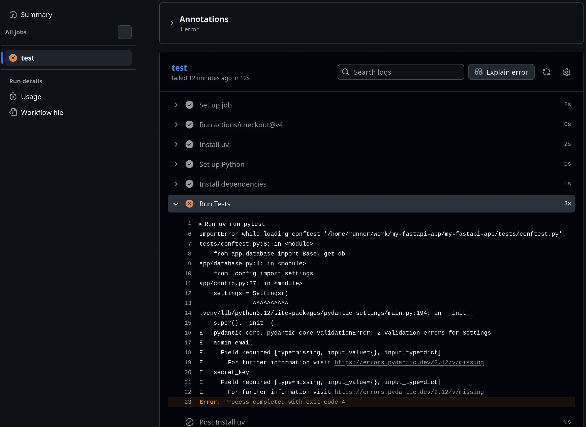
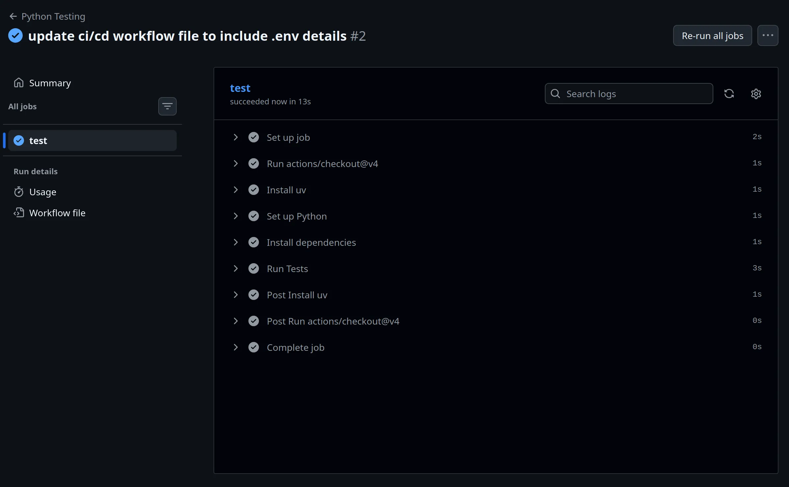

On **Day 28**, we move into the world of **Automation**. After a short New Year's break... it is time to stop manually running tests and checking for bugs. Today, we implement **CI/CD (Continuous Integration / Continuous Deployment)** using **GitHub Actions**.

This is the "pro-tier" transition. From now on, every time you push code to GitHub, a virtual machine will spin up, install your dependencies with **uv**, and run your entire test suite to make sure you didn't break anything. So, today, we ensure that no broken code ever makes it to production.

### 1. What is CI/CD?

* **Continuous Integration (CI):** Automatically building and testing your code every time you make a change.
* **Continuous Deployment (CD):** Automatically shipping that code to your server once the tests pass.

### 2. The Power of `uv` in CI

One of the biggest pain points in CI is the time it takes to install dependencies. Using the `astral-sh/setup-uv` action, we can install our environment in seconds rather than minutes.

### 3. Creating the Workflow

Create a file at `.github/workflows/test.yml`:

```yaml
name: Python Testing

on: [push, pull_request]

jobs:
  test:
    runs-on: ubuntu-latest
    steps:
      - uses: actions/checkout@v4

      - name: Install uv
        uses: astral-sh/setup-uv@v5
        with:
          enable-cache: true # Supercharges subsequent runs!

      - name: Set up Python
        run: uv python install

      - name: Install dependencies
        run: uv sync

      - name: Run Tests
        run: uv run pytest

```

### 4. Configuring Pytest for Discoverability

For `pytest` to find your `app` module correctly in the CI environment (and locally), you need to ensure your root directory is in the `PYTHONPATH`. The most robust way to do this is by adding a configuration block to your `pyproject.toml`:

```toml
[tool.pytest.ini_options]
pythonpath = ["."]
testpaths = ["tests"]
```

### 5. Why the Cache Matters?

In the YAML above, `enable-cache: true` tells GitHub to "remember" your `uv` dependencies. This means that if your `uv.lock` hasn't changed, GitHub doesn't need to download anything—it just pulls from the cache.





### 🛠️ Implementation Checklist

* [x] Created the `.github/workflows` directory.
* [x] Wrote the `test.yml` file using the `setup-uv` action.
* [x] Configured `pytest` in `pyproject.toml` for module discovery.
* [ ] Pushed the code to GitHub and watched the "Actions" tab turn green.
* [ ] Purposely broke a test and verified that GitHub blocked the "Merge" (proving the safety net works!).
* [x] Verified that my **Global Exception Handler** logic is still being tested properly in the cloud environment.

---

## 📚 Resources

1. **GitHub Docs:** [Quickstart for GitHub Actions](https://docs.github.com/en/actions/quickstart)
2. **uv Docs:** [Using uv in GitHub Actions](https://docs.astral.sh/uv/guides/integration/github/)
3. **Book:** *FastAPI: Modern Python Web Development* (Chapter 13: Deployment) - Only some general information about CI/CD.
