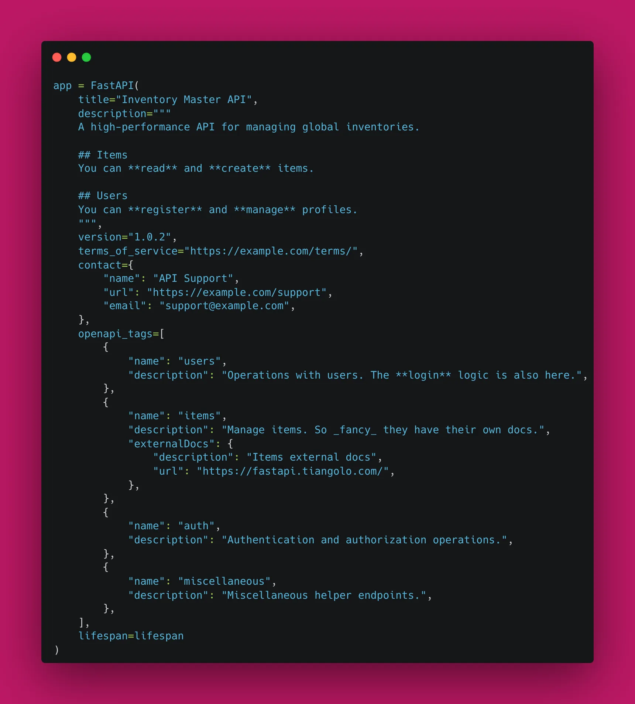
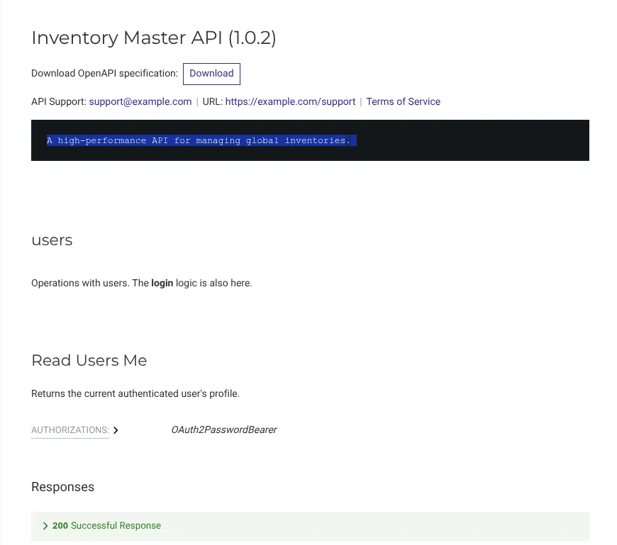

On **Day 29**, we are putting the final "polish" on our project. We are moving beyond the default settings to master **Advanced OpenAPI & Documentation**.

Everyone knows FastAPI for the automatic Swagger UI, but a professional API needs more than just a list of endpoints. Today, we’ll learn how to brand our docs, add detailed descriptions, and explore **ReDoc**—the cleaner, more "reader-friendly" alternative to Swagger.
So, without further ado, let's dive into the **Developer Experience (DX)**. If another developer uses your API, the documentation is their first impression.

### 1. Enhancing the FastAPI Constructor

You can pass a wealth of information directly into the main `FastAPI` instance. This information populates the top of your documentation pages.

```python
app = FastAPI(
    title="Inventory Master API",
    description="""
    A high-performance API for managing global inventories.
    
    ## Items
    You can **read** and **create** items.
    
    ## Users
    You can **register** and **manage** profiles.
    """,
    version="1.0.2",
    terms_of_service="https://example.com/terms/",
    contact={
        "name": "API Support",
        "url": "https://example.com/support",
        "email": "support@example.com",
    },
    openapi_tags=[
        {
            "name": "users",
            "description": "Operations with users. The **login** logic is also here.",
        },
        {
            "name": "items",
            "description": "Manage items. So _fancy_ they have their own docs.",
            "externalDocs": {
                "description": "Items external docs",
                "url": "https://fastapi.tiangolo.com/",
            },
        },
    ]
)
```



### 2. Tag Metadata & Organization

Wait, did you notice the `openapi_tags` above? While we previously used `tags=["items"]` in our routers, defining them in the `FastAPI` constructor allowed us to add rich descriptions and even external links. This makes the sidebar in Swagger and ReDoc much more informative.

### 3. Discovering ReDoc

FastAPI serves your docs at `/docs` (Swagger), but it also automatically generates them at `/redoc`. ReDoc is often preferred for public-facing documentation because it feels more like a professional manual.

### 4. Adding Examples to Models

To make your API truly intuitive, you should provide examples in your Pydantic schemas. This shows up in the "Example Value" box in Swagger.

```python
class ItemCreate(BaseModel):
    name: str
    price: float
    description: str | None = None

    model_config = {
        "json_schema_extra": {
            "examples": [
                {
                    "name": "Quantum Processor",
                    "price": 999.99,
                    "description": "A very fast CPU."
                }
            ]
        }
    }

```

### 5. Customizing the Global Exception Handler Display

Since we are using the **StarletteHTTPException** handler, we ensure our custom error responses (including `timestamp`, `path`, and custom `code`) are handled consistently across all endpoints.



### 🛠️ Implementation Checklist

* [x] Updated the `FastAPI` metadata (title, description, version).
* [x] Organized routes using `tags` in the `APIRouter`.
* [x] Added `json_schema_extra` examples to all Pydantic models.
* [x] Verified that both `/docs` and `/redoc` display the new information correctly.

---

## 📚 Resources

1. **Official Docs:** [FastAPI Metadata and Docs URLs](https://fastapi.tiangolo.com/tutorial/metadata/)
2. **Official Docs:** [FastAPI Schema Extra - Examples](https://fastapi.tiangolo.com/tutorial/schema-extra-example/)
