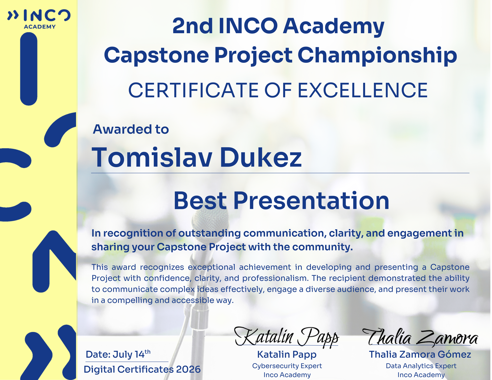
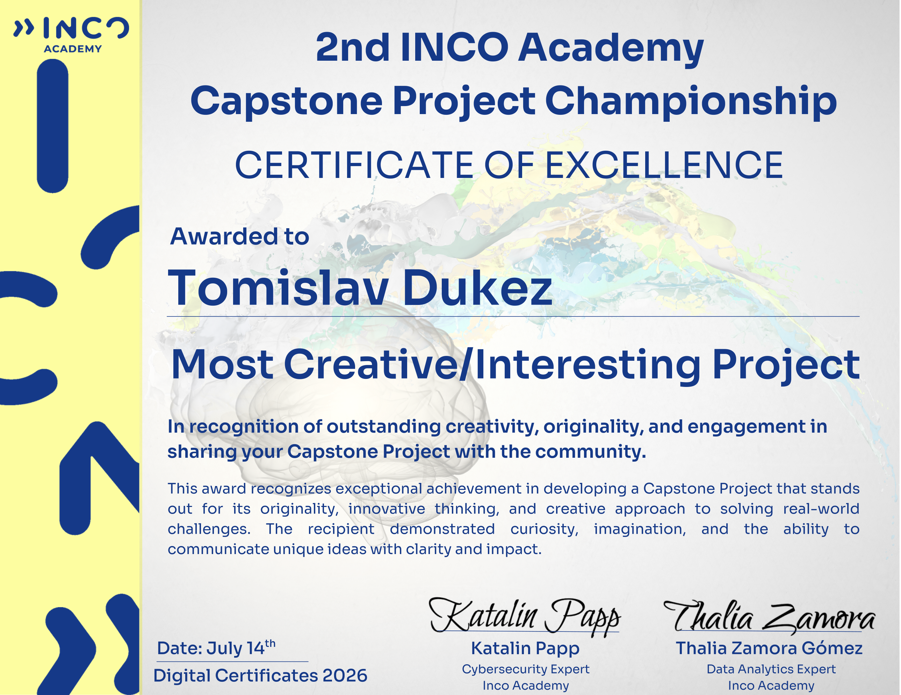
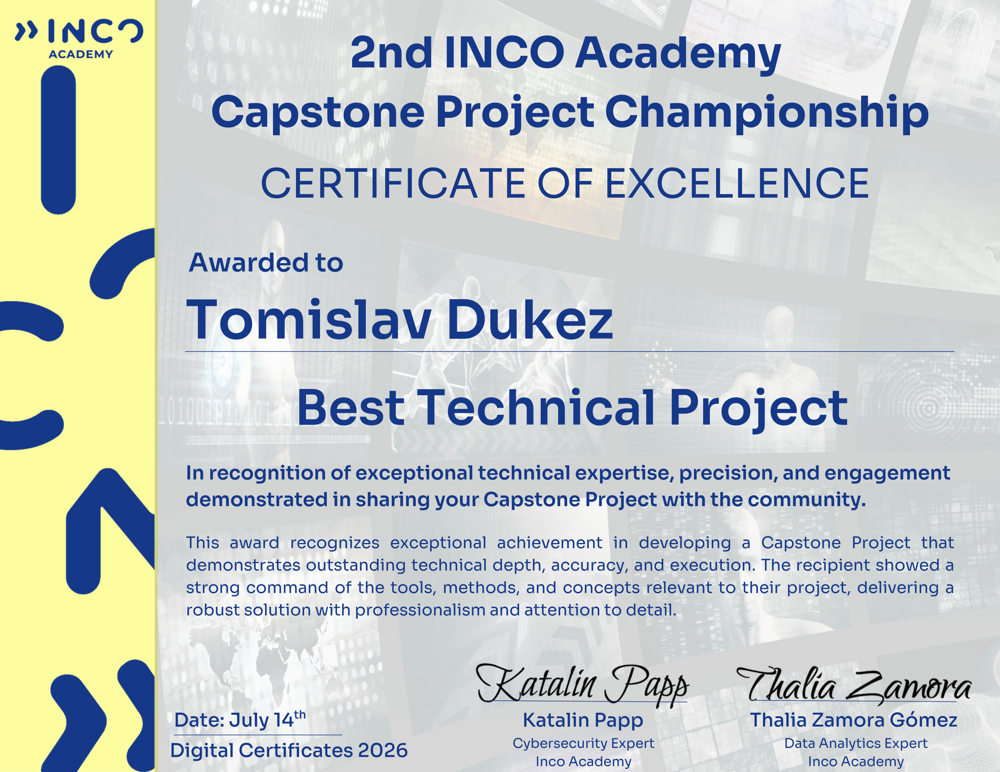

## What was going on in my life

The silence is finally over. A lot has happened over the past six months!

I’ve wrapped up the **Google AI Essentials** course, completed the **INCO Academy + Google Cybersecurity** program, participated in **Codebar's** events and mocking interviews, and joined **CodeYourFuture's** software development program. On the professional front, I’ve taken on some freelance work — including one particularly rewarding project — though a permanent, steady IT role is still in the pipeline. That will change soon... but more on that when the time is right. 😉

In the meantime, my daily coding streak continues uninterrupted. Today marks **872 consecutive days** of writing code and pushing commits to GitHub.

```
872 days of continuous code.
Not every day is easy, but the growth in my confidence
and problem-solving ability makes it all worth it.

```

Technically, I’ve been leaning heavily into **JavaScript** recently to broaden my full-stack capabilities, though **Python** remains my trusty go-to for heavy-lifting and algorithmic problem-solving.

## The INCO Academy Capstone Championship

The biggest recent highlight was taking part in the **2nd INCO Academy Capstone Project Championship**.

Out of 21 capstone presentations delivered by recent Data Analytics and Cybersecurity graduates across Europe and Africa, my project — **Fishin' Generator** — managed a clean sweep in the awards:

- 🌟 **Best Presentation Award** _(Communication, clarity, and community engagement)_
- 💡 **Most Creative / Interesting Project** _(Originality and innovative problem-solving)_
- 🤖 **Best Technical Project** _(Technical depth, accuracy, and execution)_




It was an incredible feeling to have months of consistent work validated by peers, industry experts, and the INCO team.

Building momentum, one commit and one project at a time. On to the next challenge!

If you wish to check out my project, here's the link: [https://github.com/tomdu3/fishin-generator/](https://github.com/tomdu3/fishin-generator/)

Here's the link to the YouTube video of the first day presentations (mine is the second one):
1. [YT: 2nd INCO Capstone Championship Presentations](https://www.youtube.com/live/qm53wpJB3fg)
2. [YT: 2nd INCO Capstone Championship Awards](https://youtube.com/live/DXXj1eSHR-w)

