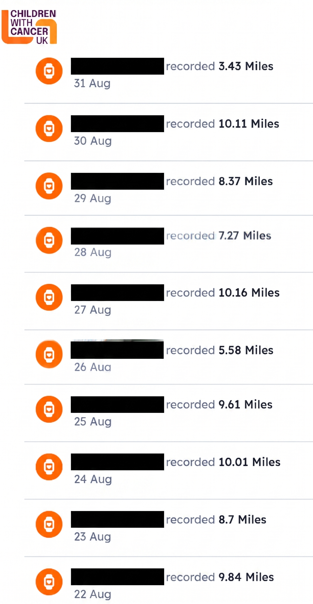

I signed up for the Children with Cancer UK **10 Mile Challenge** — walk miles throughout August, log them on the fundraiser page, raise money for a great cause. I had the walking done. What I _didn't_ want to do was spend an evening manually entering 31 separate activity entries with dates and mileage conversions.

So I automated it. Here's the exact step-by-step process, from raw Google Fit export to a fully populated fundraiser page — using a **Jupyter notebook** for data prep and **Manus AI** for the web form entry.

## 

### 1. Export Your Google Fit Data

Head to [Google Takeout](https://takeout.google.com/) and export your **Fit** data. You'll get a zip file containing daily CSV files — one per day — with columns for steps, heart rate, calories, distance, oxygen stats, and more.

Each file looks something like this:

```
Start time,End time,Move Minutes count,Calories (kcal),Distance (m),
Heart Points,Heart Minutes,Avg heart rate,Max heart rate,Min heart rate,
...,Step count,...
```

The column we care about is **`Step count`** — but it's buried among 20+ other fields. That's why we need the next step.

---

### 2. Clean the Data with a Jupyter Notebook

I used **Google Colab** to write a short notebook that reads all 31 daily CSVs and extracts just the step count per day.

**Cell 1 — Import pandas:**

```python
import pandas as pd
```

**Cell 2 — Loop through all 31 days and aggregate:**

```python
final_df = pd.DataFrame(columns=['date', 'steps'])
for i in range(31):
    date = f'2026-08-{str(i+1).zfill(2)}'
    df = pd.read_csv(f'/content/{date}.csv')
    total_steps_of_the_day = int(df['Step count'].sum())
    new_row = pd.DataFrame({'date': date, 'steps': total_steps_of_the_day}, index=[0])
    final_df = pd.concat([final_df, new_row], ignore_index=True)
```

**Cell 3 — Preview the result:**

```python
final_df
```

This outputs a clean table:

|     | date       | steps |
| --- | ---------- | ----- |
| 0   | 2026-08-01 | 13697 |
| 1   | 2026-08-02 | 15789 |
| 2   | 2026-08-03 | 15634 |
| ... | ...        | ...   |
| 30  | 2026-08-31 | 6854  |

**Cell 4 — Export to CSV:**

```python
final_df.to_csv('/content/Steps_08_26.csv')
```

The output is a tidy two-column file: `date` and `steps`. Total for August: **472,434 steps**.

---


### 3. Upload to Manus AI and Give It a Prompt

Open [Manus.im](https://manus.im), upload `Steps_08_26.csv`, and tell it what you want. Here's the exact prompt I used:

> _I want Manus to fill up the fundraising details on a website for Children with Cancer UK with my steps details. Here's the access link [URL]. You have the step details in the CSV._

That's it. One paragraph. Manus takes it from here.

---

### 4. Answer Manus's Clarifying Questions

Manus didn't blindly start entering data. It read the CSV, inspected the fundraiser site, and came back with two smart questions:

**Question 1 — Unit mismatch:**

> _The activity form accepts miles, not steps. Your CSV records 472,434 steps from 1–31 August 2026, but it does not contain a distance or a steps-to-mile conversion. Please tell me the conversion you want used._

**My answer:** `2,000 steps = 1 mile`

**Question 2 — Entry format:**

> _Option A — One cumulative entry of 236.22 miles dated 31 August. Option B — 31 separate entries, each dated and converted from that day's steps._

**My answer:** `B` (daily records)

This is exactly what you want from an AI agent — it identifies problems before they become mistakes and gives you clear options.

---

### 5. Let Manus Do the Work

After my answers, Manus:

1. **Wrote a Python conversion script** using `Decimal` with half-up rounding to avoid floating-point errors:

```python
from decimal import Decimal, ROUND_HALF_UP

STEPS_PER_MILE = Decimal('2000')

for record in csv.DictReader(source_file):
    exact_miles = Decimal(steps) / STEPS_PER_MILE
    displayed_miles = exact_miles.quantize(Decimal('0.01'), rounding=ROUND_HALF_UP)
```

1. **Generated a daily mileage schedule** — a markdown table with date, steps, and miles for all 31 days:

| Date           |  Steps | Miles to post |
| -------------- | -----: | ------------: |
| 1 August 2026  | 13,697 |          6.85 |
| 2 August 2026  | 15,789 |          7.89 |
| 3 August 2026  | 15,634 |          7.82 |
| ...            |    ... |           ... |
| 30 August 2026 | 20,212 |         10.11 |
| 31 August 2026 |  6,854 |          3.43 |

1. **Posted all 31 entries** to the Children with Cancer UK fundraiser site — one by one, each with the correct date and mileage. Every submission returned HTTP **200**.

---

### 6. Verify the Result

After all 31 entries were posted, the live Activity challenge tracker displayed **236.23 miles** — matching the expected sum of the 31 individually rounded daily values.

- ✅ 31 entries posted
- ✅ All HTTP 200 responses
- ✅ Public tracker shows correct total
- ✅ Login token expired after completion (task done)

---

## 📊 The Numbers

| Metric              | Value                   |
| ------------------- | ----------------------- |
| Total steps         | 472,434                 |
| Total miles         | 236.23                  |
| Days recorded       | 31                      |
| Average daily steps | ~15,240                 |
| Highest day         | 20,833 steps (5 August) |
| Lowest day          | 6,854 steps (31 August) |

## 

## 🛠️ What You Need to Replicate This

- [x] A Google Fit account with step data
- [x] Google Takeout export of Fit data
- [x] A Jupyter/Colab environment with pandas
- [x] A Manus.im account: use my [reference link](https://manus.im/invitation/DFJNKSJBGWWXX?utm_source=invitation&utm_medium=social&utm_campaign=copy_link) and you can get 500 credits.
- [x] A web form that accepts activity entries (with date + distance)

---

## 🧠 Final Thoughts

The whole process took about 15 minutes of my time — mostly writing the prompt and answering two questions. The Jupyter notebook took 5 minutes to write, and Manus handled the rest.

The key insight? **The data preparation step is where the real value is.** If you can get your data into a clean, simple CSV — two columns, no junk — you open the door for AI agents to do the rest. Manus couldn't have done anything with 31 raw Google Fit exports. But with a tidy CSV? It was smooth sailing.

---

## Resources

1. **Manus AI:** [manus.im](https://manus.im/invitation/DFJNKSJBGWWXX?utm_source=invitation&utm_medium=social&utm_campaign=copy_link)
2. **Google Takeout:** [takeout.google.com](https://takeout.google.com/)
3. **Python Decimal module:** [docs.python.org/3/library/decimal.html](https://docs.python.org/3/library/decimal.html)
4. **Manus AI: The Dawn of True General AI Agents**:[https://wowlabz.com/manus-ai-true-general-ai-agent](https://wowlabz.com/manus-ai-true-general-ai-agent/)
