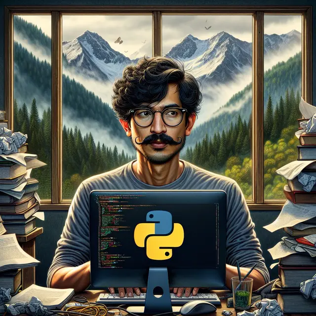
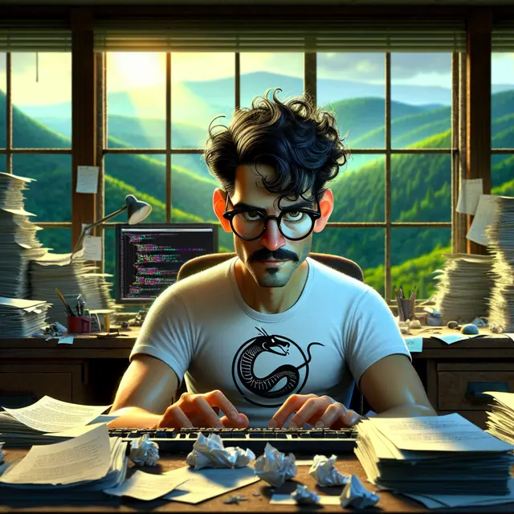

## 🔹 The Problem: Why Social Coding Can Feel Overwhelming

As a developer, I’ve always loved the _logic_ of coding—but the _social_ side? Not so much. Networking events, pair programming, and even asking for help in forums sometimes felt like navigating a maze blindfolded. And I’m not alone. Many neurodivergent or introverted coders (myself included) struggle with the pressure of constant interaction, even when we’re passionate about tech.

That’s when I thought: _What if there was a space where you could code, learn, and create—without the social friction?_

## 🚀 The Idea: An AI-Powered Safe Space

Enter **Closeted Coders**—a simple but powerful AI chat platform designed for developers who, like me, prefer a quieter, more independent learning environment.

Built with **Next.js** and deployed on **Vercel**, the site offers two key features:

1. **🤖 AI Coding Assistant** – Ask coding questions, debug errors, or brainstorm solutions in a judgment-free chat.
2. **🎨 Dreamworks-Style AI Art Generator** – Describe an image, and DALL·E brings it to life in vibrant, animated movie-style art.

No awkward interactions. No anxiety. Just pure, unfiltered coding + creativity.

## 💡 The Tech: How I Harnessed OpenAI’s API

This project was my first real dive into the **OpenAI API**, and it was a game-changer. Here’s how it works:

- **Text Chat**: A simple POST request sends user prompts to GPT, streaming back responses in a continuous conversation.
- **Image Generation**: A description is passed to DALL·E, which returns a whimsical, Dreamworks-inspired image.

The biggest lesson? **AI doesn’t just automate tasks—it can also make technology more accessible.**

## 🌱 Why This Matters

Not every coder thrives in loud, collaborative spaces—and that’s okay. With _Closeted Coders_, I wanted to create a **low-pressure playground** where neurodivergent and introverted devs can:

✅ Learn at their own pace  
✅ Experiment without fear of judgment  
✅ Express ideas visually, even if words are hard

It’s a small project, but it’s proof that AI can bridge gaps—not just in functionality, but in _inclusivity_.

## 🔜 What’s Next?

I’m already brainstorming upgrades:

- Customizable AI personalities (e.g., "Explain like I’m 10")
- A "quiet mode" with minimal UI distractions
- Support for more animation styles (Pixar, Studio Ghibli?)

**Have feedback or ideas?** I’d love to hear from fellow devs who resonate with this! Drop a comment or try it out:
Deployed on Vercel: [https://closeted-coders-ai-chat.vercel.app/](https://closeted-coders-ai-chat.vercel.app/)
GitHub repo: [https://github.com/tomdu3/nextjs-a--chatbot](https://github.com/tomdu3/nextjs-a--chatbot)
