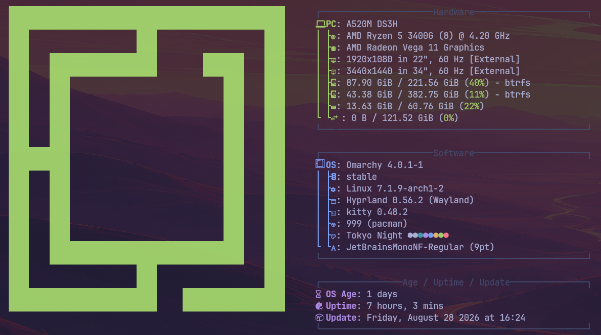
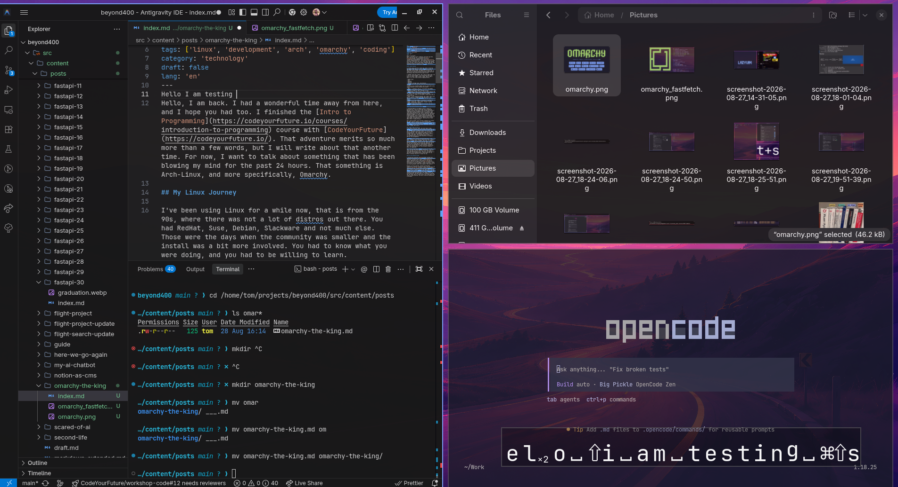

Hello, I'm back! I’ve had a wonderful break away from the blog, and I hope life has been treating you just as well.

I recently completed the [Intro to Programming](https://codeyourfuture.io/courses/introduction-to-programming) course with [CodeYourFuture](https://codeyourfuture.io/). That adventure alone deserves an entire novel, but I'll save those war stories for another day. Right now, I need to talk about something that has completely hijacked my brain for the past 24 hours: Arch Linux—or more specifically, **Omarchy**.

---

## The Confessions of a Serial Distro Hopper

I’ve been using Linux since the 1990s—back when dinosaurs roamed the earth and you had maybe four distributions to choose from: Red Hat, SuSE, Debian, Slackware, and a mountain of compilation errors.

Those were the days when the community was intimate, and installing an OS felt like defusing a bomb in the dark while reading a man page printed on stone tablets. You had to know what you were doing, or at least pretend really convincingly while breaking your X11 config.

I remember those days fondly. But if I’m being completely honest with myself: I am a chronic, incurable distro hopper. If an operating system exists, there’s a 98% chance I’ve booted it on my machine.

Here is a brief, mildly embarrassing tour of my distro hopping history:

- **Red Hat Linux** — The OG gateway drug.
- **SuSE** — The friendly green chameleon.
- **Mandrake / Mandriva** — Ah, the golden era of "Linux for normal humans" before Ubuntu took over the world.
- **Slackware (College Linux, Jedi Edition)** — Because who _didn't_ want to feel like a terminal-wielding Unix wizard?
- **Knoppix** — Absolute witchcraft. The first live CD that could boot up and play DVDs straight out of the box!
- **Ubuntu** — We had a long, happy marriage… until Canonical introduced the Unity desktop and broke my heart.
- **Linux Mint** — The rebound relationship that actually treated me with respect.
- **Fedora** — I really wanted to love it. It had the Red Hat pedigree, after all. Sadly, the feeling was not mutual.
- **Manjaro** — True love at first boot… right up until an update set everything on fire.
- **EndeavourOS** — Arch for sensible people. I tried hard to bond with it, but the spark just wasn't there.
- **Garuda** — Gorgeous, but the full edition felt like being blasted in the face by RGB gaming lasers, while the barebones edition was a bit too spartan.
- **Arch Linux (Vanilla)** — Absolute perfection, provided you have 40 hours a week to handcraft your own desktop environment from scratch.
- **NixOS** — Mind-blowing declarative wizardry, until you realize you need an unmaintained package and have to write a PhD thesis in Nix expression language just to get it running.
- **CachyOS** — Blazingly fast, finely tuned, and great fun… but my wanderlust struck again.
- **Pop!\_OS** — Loved Rust, loved COSMIC, but my graphics card and my Neovim config staged a full-blown mutiny against it.
- **Omarchy** — I was skeptical. Previous versions didn't quite click. But _Quattro_? Quattro is something else entirely. Wow.

---

## The Pop!\_OS Meltdown: My Final Breaking Point

Before finding Omarchy, I had settled into Pop!\_OS. For about a month, things went swimmingly. Sure, I had to pay the standard Wayland tax and wrestle with GPU compatibility so my machine wouldn't spontaneously combust whenever I shared my screen on Slack or edited code with Neovim in Kitty terminal. But I made it work.

Then, out of nowhere, Neovim entered a haunted phase.

I’m not exaggerating. My fuzzy finder developed sentience and kept opening itself randomly. In the Tree-sitter file view, folders refused to stay open—the second I released a key, they slammed shut like startled clams.

I reinstalled the entire OS. Same issue. I wiped my config and ran completely vanilla Neovim. _Still possessed._ Curiously, it only worked properly inside Cosmic-Terminal.

Defeated and exhausted, I threw my hands in the air and said, _"That's it. I'm crawling back to Ubuntu."_

But right as I went to grab the ISO, the tech universe intervened. YouTube and tech blogs were suddenly overflowing with news about Omarchy. And DHH (David Heinemeier Hansson)—the famously opinionated Ruby on Rails mastermind behind it—was everywhere, preaching the gospel of a modern, keyboard-first desktop and AI first Operating System.

That particular brand of unapologetic, hyper-opinionated crazy? _That is 100% my kind of crazy._

I said: let's do it.

---

## I Didn't Want to Love It (Yet Here We Are)

If my memory serves me right, previous versions of Omarchy required you to manually install Arch first, survive the terminal gauntlet, and then run an install script while praying to the package gods.

This time around? You just grab the ISO, flash it, and install it like any modern distro.

The entire process took less than 5 minutes. A clean welcome screen, a couple of intuitive clicks, and boom—a fully functional, finely tuned Arch Linux workstation ready to rock. And boy, is it gorgeous.

### Why It Won Me Over

- **[Hyprland](https://github.com/hyprwm/hyprland) Done Right:** Hyprland is pure magic. I fell in love with it on vanilla Arch months ago, right up until a system update nuked my setup into the shadow realm. In Omarchy, Hyprland has that eye-catching Garuda-level polish, but with tasteful restraint—sleek, fast, and without the retina-burning neon overload.
- **A True AI-First Desktop:** This isn't just a chatbot widget slapped onto the corner of your screen for trivia. The AI is woven directly into the system workflow to assist with configuration, diagnose crashes, build extensions, and tweak your environment. I haven’t felt this genuinely excited about an OS since I was counting down the days for the 2013 Ubuntu releases.
- **Rock-Solid Stability & Wayland Bliss:** Zero Wayland glitches. None. Screen sharing works, Kitty flies, and Omarchy even includes its own curated AUR repository for safe, painless package management.
- **Tiling Heaven for Keyboard Nerds:** As a fussy, Neovim-obsessed developer, navigating an entire desktop environment via intuitive shortcuts feels completely natural. My mouse has officially been placed on unpaid administrative leave.

---

## The First AI Test: Fixing "Show Me the Key"

To test the system's capabilities, I installed [OpenCode](https://github.com/opencode-dev/opencode) via Omarchy’s AI-powered package installer. The setup was effortless, and I chose [Big Pickle](https://pi.dev/models/opencode/big-pickle) as my AI model (a humble tribute to Python, of course).

Then came the real challenge.

Since I do programming tutoring, displaying my keystrokes on-screen—especially while navigating Neovim—is an absolute necessity. My go-to tool for this has always been [Show me the Key](https://github.com/AlynxZhou/showmethekey).

Historically, keystroke visualizers and Wayland/Hyprland compositors have a strained relationship. Unsurprisingly, it failed to work out of the box.

Normally, this would mean two hours of digging through obscure forum threads and GitHub issues. Instead, I let OpenCode have a crack at it:

1. It analyzed the Hyprland compatibility problem.
2. It diagnosed the missing permissions and config tweaks.
3. It fixed the issue on the **very first try**.

The best part? It didn't just silently patch files and leave me in the dark. It explained exactly what the underlying issue was, what changes it made to resolve it, and how to verify the result. No nasty surprises, no black-box magic. I saved the entire explanation into markdown for future reference, customized my visual preferences, and was ready to roll in minutes.

---

## The Verdict

Omarchy Quattro took a cynical, battle-hardened distro hopper and turned me into an absolute believer in under 24 hours. If you love keyboard-driven workflows, tiling window managers, and an operating system that actually respects your intelligence while saving you hours of tinkering, give it a spin.

That’s all for now—see you very soon with more updates from the Arch side!
