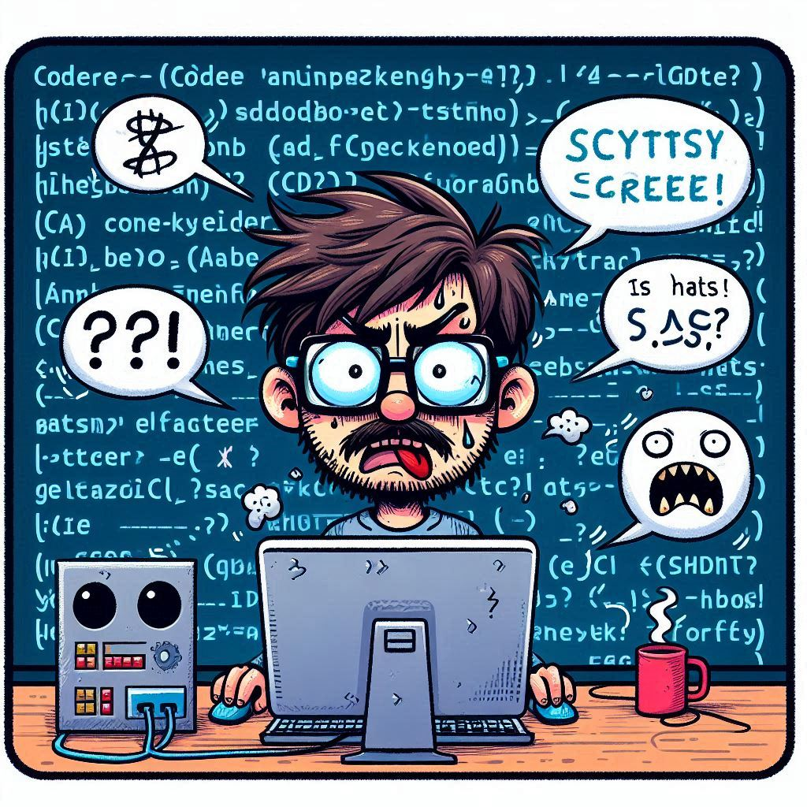
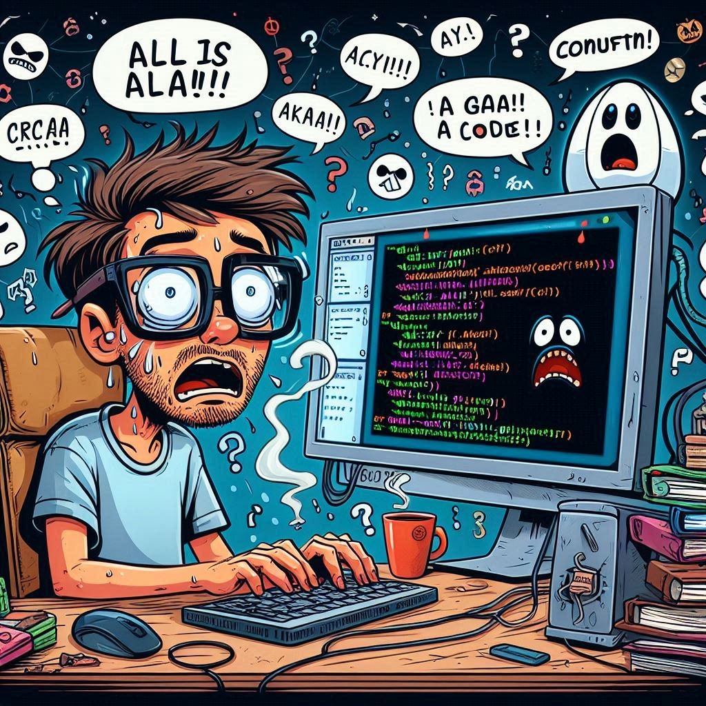
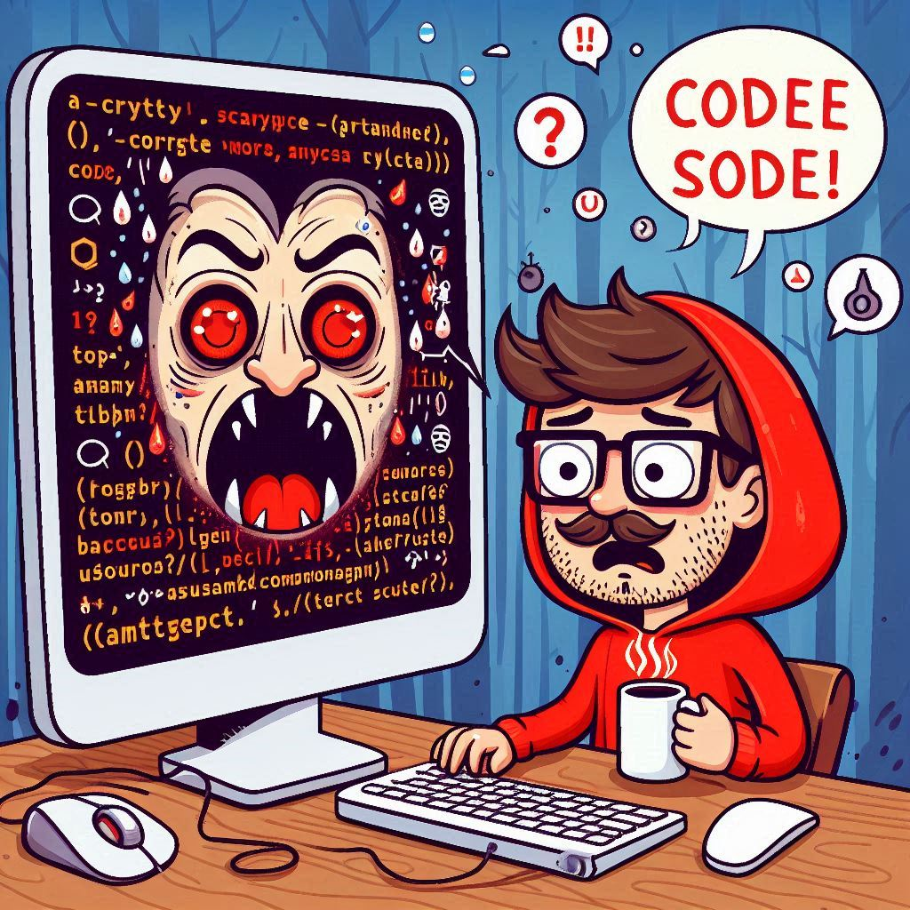

In the last month, I’ve had a few job interviews for software developer roles — but not with people. With AIs.

That’s right: robots asking questions, summarizing my responses, underlining key points, even thanking me for my time. If it sounds awkward… that’s because it *absolutely* is.

## 🎤 The Interviewer Will See You Now (and It’s a Bot)

It starts simple: an AI pops up on screen, introduces itself with an unsettling level of cheer, and jumps right into the questions. It tracks your speech, nods politely (I guess?), and then paraphrases your answers back to you like some kind of automated therapist.

The weirdest part? The AI tries to act *human*. It encourages me. It tells me “thanks” at the end. It’s like talking to a customer service rep who’s been possessed by Siri.

## 🔁 The Loop of Doom

Two of these interviews didn’t go well. Not because I bombed — because the system glitched out.

In one, the AI kept repeating the same question. Over and over. I answered. It asked again. I rephrased. No feedback, no indication that I was doing anything right or wrong. Just a broken loop. Like Groundhog Day, but with less Bill Murray and more frustration.

## 🧨 Countdown to Nowhere

In the worst one, the AI only managed to ask *one* of the four questions it was supposed to. A countdown timer blinked ominously on the screen while a red line passed from one argument to the next — like a game show gone rogue.

But nothing happened. No next question. Just me, rambling into the void for 20 straight minutes while the AI stared blankly. The interview was supposed to last 40 minutes. I spent half of it wondering if I was being pranked.

## 📬 “Dear \[Name of Applicant]…”

The cherry on top? After submitting another application, I got a rejection email **two minutes later**. That’s fast even for AI.

Worse, it began with:

> “Dear \[Name of Applicant], after careful and thorough evaluation of your CV…”

I would *carefully and thoroughly* bet they didn’t even open the file. My name wasn’t filled in, and I doubt anyone — human or bot — looked at my résumé.

## 🤖 The Future Is... Kind of Broken

Look, I get it. Automating interviews saves time. It’s efficient. But right now, it feels more like beta testing on real people — with no real accountability or support when the system breaks.

And for candidates, that’s frustrating. Because we’re not just talking to machines. We’re putting ourselves out there, trying to show who we are — while a glitchy script judges us in silence.

## 🧠 Final Thoughts from a Human

I’m not against AI. I use it. I work with it. But trusting it to fully handle human interaction — like job interviews — feels premature. There's too much nuance, too much context lost in translation.

So yeah, I'm scared of AI interviews. Not because I think the bots are better — but because they’re not ready.

And they’re already in charge.