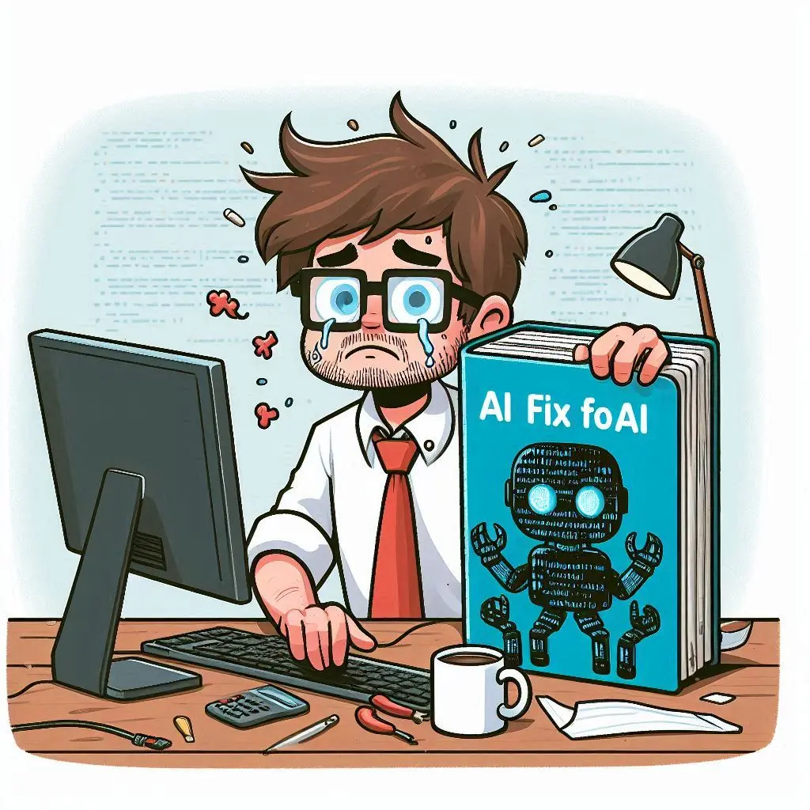

# When Free AI Gives Your Portfolio a Second Life 🚀✨

## The Moment of Realization 💭🔍
Ever had that moment when you revisit an old project and discover it’s not quite cutting it anymore? That’s exactly what happened with my portfolio site! 🌐💔

## The Creation Journey 🛠️🎨
A few months back, I built this slick portfolio page following Adrian Twarog's tutorial. The crown jewel? A super cool chatbot feature powered by NextJS! 🤖💬 But you know how the story goes with AI services – when the free credits run dry, things come to a standstill. In my case, OpenAI's meter hit zero, and my chatbot was left in the dust. ⏳🕸️

## The Quest for Alternatives 🔄💡
Instead of letting my chatbot gather digital dust, I decided to explore the land of free AI alternatives! 🌍✨ After some digging, I discovered DeepSeek through openrouter.ai. I dove in with their R1 model, and after some good old-fashioned code tinkering, I had everything up and running again! 🔧💻

## See It in Action! 🚀👀
Want to see the revitalized chatbot in action? Check it out here: 👉 [My Portfolio](https://portfolio-egox.onrender.com/)  
For all the curious developers out there, I've made the code available on GitHub! 🖥️🔗 [Explore on GitHub](https://github.com/tomdu3/portfolio)

## The Satisfaction of Revamping 🎉🆕
Sometimes, taking a break from "serious" work to revisit and revamp old projects can be surprisingly satisfying! 😌✨ Plus, it’s a great way to stay updated with the ever-evolving AI landscape while keeping your portfolio fresh and functional! 🌟💪

Happy coding! 🖖💙